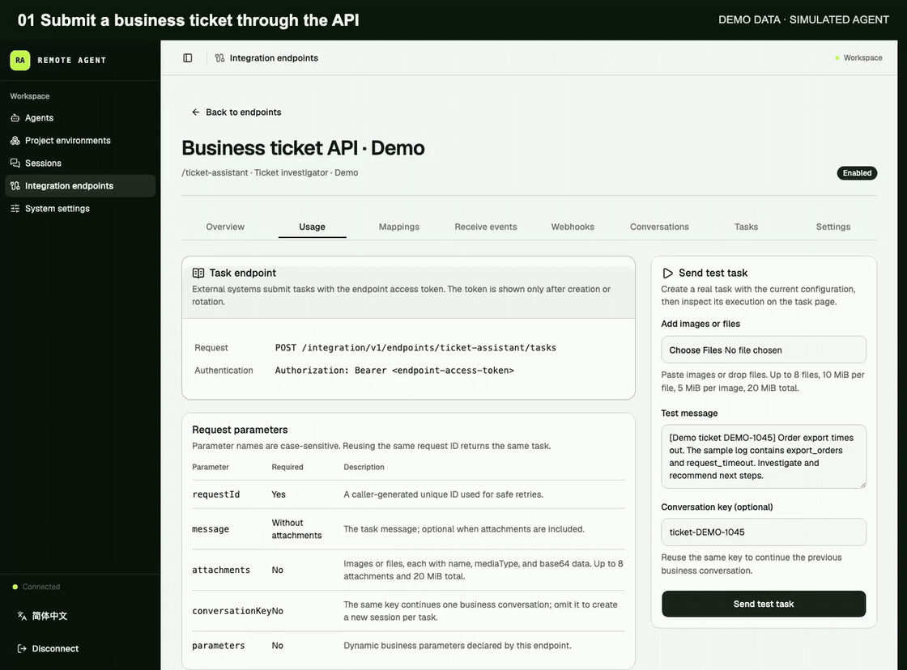
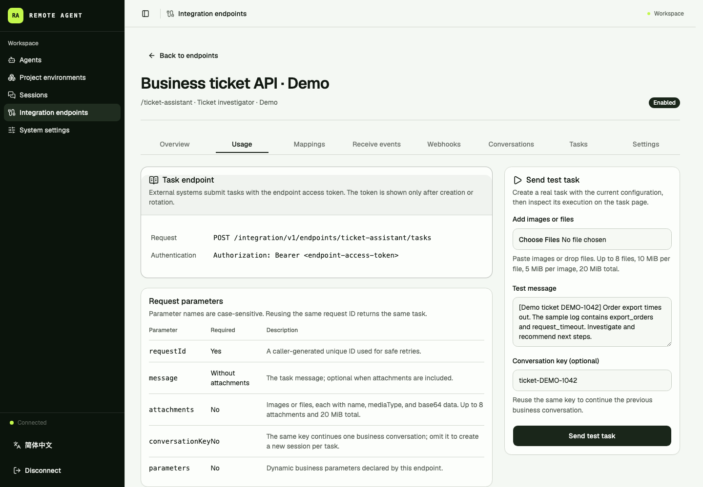
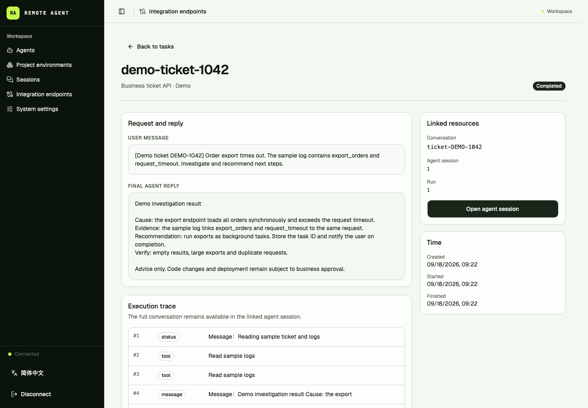
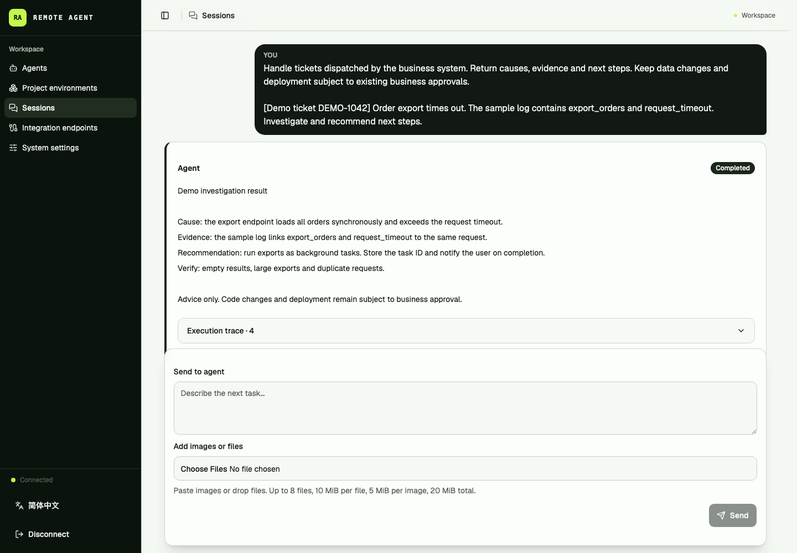

# Remote Agent Server

[简体中文](README.md) · [MIT License](LICENSE) · Node.js 22 · macOS / Linux

**Connect Claude Code, Codex, and Hermes to your tickets, CI, and business applications.**

Deploy on your own machine. Run tasks from the web console, or call familiar command-line agents through an HTTP API or GitHub / GitLab webhooks. Remote Agent Server manages queues, workspaces, sessions, and execution records. Your application receives progress and results through polling, SSE, or signed webhooks.

Prepare repositories and dependencies once, then give each session an independent copy-on-write workspace. Continue the conversation in the same session; submitted tasks keep running when the caller disconnects.

Under the hood, it is a self-hosted execution gateway built on [acpx](https://github.com/openclaw/acpx) and the [Agent Client Protocol (ACP)](https://github.com/agentclientprotocol), with Skills, MCP, provider extensions, and model policies. A single Fastify process uses SQLite WAL, with no separate database server or message broker to deploy.

[Demo](#business-integration-demo) · [Install and start](#install-and-start) · [Run your first task](#complete-one-agent-run) · [HTTP / webhook integration](#integrating-another-system) · [Features](#features) · [Execution model](#execution-model) · [Configuration](#configuration) · [Deployment guide](docs/deployment.md)

## Business integration demo

A ticket investigation workflow: **submit work through the Task API → inspect status and results → open the linked session to continue**.



Recorded from the real management console with synthetic tickets, simulated tool events, and fixed replies. No live model was called. This illustrates the API and UI workflow, not model quality or execution speed. [Watch the MP4](docs/media/business-workflow-en.mp4) · [Integration guide](#integrating-another-system)

<details>
<summary>View full screenshots: API entry point, task result, and session history</summary>

**API entry point**: inspect the HTTP endpoint, authentication, and parameters, then try a task from the console.



**Task result**: review the business request, final reply, execution trace, and linked session together.



**Session history**: inspect messages and tool events, then add more context to the same conversation.



</details>

## Use cases

| What you want to do | How to use it |
| --- | --- |
| Run and continue agent tasks in a browser | Prepare a project environment, create an agent and session, and inspect messages, tool activity, and results in the console. |
| Send PR / MR events to a review agent | Configure GitHub / GitLab webhooks and event filters. Query results or receive callbacks; posting comments requires additional tools and permissions. |
| Dispatch code investigation from a ticketing or operations platform | Submit logs, instructions, or attachments through the Task API, then add context using the same business conversation key. |
| Call agents from existing shell scripts, CI/CD, or internal tools | Use curl or any HTTP client to submit asynchronous work, store the task ID, and poll for results or receive callbacks. |

Built for developers and teams already using agent CLIs who want to connect them to ongoing business workflows. Start with one task in the console, then integrate your existing systems. Keep using your scripts, CI, approval rules, and release process.

Providers still own reasoning, tool use, and native sessions; callers own business approvals, ticket state machines, and deployment rules. You manage the code and execution records, while model calls follow your provider's authentication, billing, and data-transfer behavior. The current deployment model is one machine used by trusted users. Workspaces isolate file copies; **they are not containers or security sandboxes**. See the [security boundary](#security-boundary).

## Features

- **Asynchronous Task API:** submit work over HTTP, prevent duplicate execution with idempotency keys, query or cancel tasks, and continue multi-turn conversations.
- **Reliable event delivery:** consume incremental event history, resumable SSE, or signed Webhooks without tying task execution to a live connection.
- **Agent management:** configure providers, instructions, project environments, Skills, and MCP in one place.
- **Reusable project environments:** prepare one or more Git repositories and their dependencies before sessions start.
- **Isolated workspaces:** use APFS clones on macOS or Btrfs snapshots on Linux to create copy-on-write session environments.
- **Multi-turn conversations:** execute multiple runs in one session and resume the ACP session where supported.
- **Recorded executions:** persist user messages, agent output, tool activity, statuses, errors, and results in SQLite.
- **Skill management:** discover host Skills, upload ZIPs or add Git/marketplace sources, preview changes, and update or roll back each agent independently.
- **Provider extensions:** discover system plugins and hooks from Codex and Claude Code, select them per agent, and project them into that agent's Provider Home at runtime.
- **MCP management:** configure HTTP and stdio MCP with fixed, session, or runtime values, import MCP from provider system configuration, and inspect exposed tools.
- **Model policies:** discover models advertised by Agent Core over ACP, follow the Core default, pin one model, or select a model for each new run with UTC weekdays and 24-hour windows.
- **Runtime, storage, and concurrency control:** adjust run timeout, large idle-session storage retention, and three service concurrency limits from the console, with an optional run limit per agent.
- **Headed browser support:** run agents in a real desktop session without requiring containers.
- **GitHub / GitLab event ingress:** native webhook verification, filters, filter previews, and receipt history, using the same execution flow as the Task API.
- **Image and file tasks:** upload, drop, or paste attachments in the console, or submit mixed and attachment-only messages through the API. Interpretation depends on the provider, model, and tools.
- **Setup and diagnostics:** `pnpm run init` generates configuration, `pnpm run doctor` verifies native workspace operations, and the console guides first use.

## Execution model

The external integration API is the primary service interface:

```text
External system
   |
   v
Integration endpoint (auth / parameter mapping / idempotency)
   |
   v
Task -> Conversation -> Session -> isolated Workspace -> acpx/ACP -> Provider
   |                         |
   |                         +-> Skills / provider extensions / MCP / model policy
   |
   +-> status / event history / SSE / signed Webhook
```

Operators can also create Sessions and Runs directly from the web console:

```text
Project environment -> Agent -> Session -> Run -> acpx/ACP -> Provider
                               |
                               +-> messages, tool activity, status, result
```

| Object | Purpose |
| --- | --- |
| Project environment | A versioned, prepared set of one or more Git repositories. |
| Agent | A provider, project environment, instructions, Skills, provider extensions, MCP, model policy, and concurrency policy. |
| Session | An isolated workspace and a continuing agent conversation. |
| Run | One input and its recorded execution inside a session. |
| Integration endpoint | An authenticated external entry point bound to one agent. |
| Conversation | A multi-turn external conversation that reuses one session. |
| Task | One asynchronous external request that eventually maps to a run. |

## Requirements

- Node.js 22 (the tested version is pinned in `.nvmrc`)
- pnpm 10 through Corepack
- Git
- At least one installed and authenticated provider CLI
- APFS on macOS, or Btrfs that the service user can operate on Linux
- `btrfs-progs` on Linux, with the service user able to run `btrfs subvolume create/snapshot/delete`
- A real desktop/X display for headed browser automation

Project environments and session workspaces use APFS clones or Btrfs snapshots. There is no ordinary directory-copy fallback. Prepare the filesystem with the [deployment guide](docs/deployment.md) on a new host.

## Install and start

```bash
git clone https://github.com/ma-pony/remote-agent-server.git
cd remote-agent-server

nvm install
corepack enable
pnpm install --frozen-lockfile
pnpm run init
pnpm start
```

`pnpm run init` generates a random `API_TOKEN` and a private `0600` `.env`, creates storage directories, and verifies workspace creation, cloning/snapshotting, independent writes, and cleanup. An `API_TOKEN` already supplied by the process environment is reused. Existing `.env` files and tokens are preserved. Provider detection checks executable availability without logging in or calling a model.

- **macOS:** storage defaults to `~/Library/Application Support/remote-agent-server`; the commands above normally work directly.
- **Linux:** storage defaults to `/srv/remote-agent`. First prepare a writable Btrfs directory using the [deployment guide](docs/deployment.md#linuxbtrfs-原生部署). For another location, use `pnpm run init --root /your-btrfs-directory/remote-agent` on the first run instead of configuring four separate storage paths.

Failed checks explain the problem and do not save a new `.env`. Correct permissions or filesystem configuration and retry. Initialization never formats disks, changes mounts, or falls back to directory copies. `--root` only applies when creating a new configuration; existing installations retain their configured paths.

The server automatically reads `.env` from its working directory, with inherited process environment variables taking precedence. No `source` command is needed. Files are parsed as dotenv data: shell commands, `$HOME`, `~`, and variable references are not expanded. Use absolute paths when editing the file.

To check an installation later:

```bash
pnpm run doctor
```

`doctor` checks existing configuration and workspace operations, removes its probe files, and never creates or modifies `.env` or starts a real Agent. Environment-only deployments are supported. Passing the workspace check does not establish Provider authentication or model availability.

`pnpm start` builds both the server and web console before starting in production mode. A directly invoked compiled Node entrypoint exits with a clear error when the web build is missing.

Check the server:

```bash
curl --fail http://127.0.0.1:3000/api/health
```

Open `http://127.0.0.1:3000` and copy the value of `API_TOKEN` from `.env` into the login screen. Setup and startup logs never print the token; the web interface keeps it only in the current browser session. Generated configurations listen on `127.0.0.1` by default. For remote access, use SSH forwarding or configure the listening address and a TLS reverse proxy as described in the deployment guide.

Follow the first-use path: **project environment → Agent → session**. When no environment is ready, the console links directly to creating or inspecting one. Start with one Provider; add Skills, MCP, and integrations after the first task works.

### Manual configuration and direct startup

You can also manage configuration manually. For a new installation without an existing `.env`:

```bash
cp -n .env.example .env
chmod 0600 .env
openssl rand -hex 32
```

Put the generated random value in `.env` as `API_TOKEN` and set absolute storage paths writable by the service user. Use APFS on macOS or Btrfs on Linux, with environment and session roots on the same filesystem. Then check, build, and run directly:

```bash
pnpm run doctor
pnpm build
NODE_ENV=production node dist/server/main.js
```

The server loads `.env` automatically; no `source` command is needed. You can instead supply all configuration through shell environment variables or a systemd `EnvironmentFile`; inherited process values take precedence. See the [deployment guide](docs/deployment.md) for LaunchAgent / systemd examples and [configuration](#configuration) for every variable.

### Local development

After initialization, run directly:

```bash
pnpm dev
```

This starts the watched API server and Vite development server together. Both read `PORT` from the project `.env`, with an inherited `PORT` taking precedence. Vite defaults to `http://127.0.0.1:5173` and proxies `/api` and `/integration` to that API port. Frontend edits use hot module replacement without rebuilding or restarting the API.

## Complete one agent run

### 1. Prepare a provider

Install and authenticate the provider CLI as the same operating-system user that runs the server. Follow the provider's official instructions:

- [Claude Code](https://code.claude.com/docs/en/getting-started)
- [Codex CLI](https://developers.openai.com/codex/cli)
- [Hermes Agent](https://hermes-agent.nousresearch.com/docs/getting-started/quickstart/)

Command reference: run only the commands for the provider you selected.

```bash
claude auth login
codex login
claude auth status
codex login status
claude --version
codex --version
hermes --version
```

Authenticate and configure models only for the providers you intend to use, under the operating-system user that runs the service.

At startup, the server reads the login-shell PATH and merges it with the current Node directory and process PATH. Each agent has its own Provider Home. The server prepares baseline configuration, authentication, and model information from the service user's Provider Home while excluding session history, logs, and temporary runtime data. System plugins, hooks, and global MCP from Codex and Claude Code are optional configuration sources; agents never inherit them implicitly.

### 2. Create a project environment

Open **Project environments → New project environment**:

1. Add one or more Git repositories the agent may need.
2. Add an optional preparation command per repository, such as `pnpm install`, `bundle install`, or `uv sync`.
3. Select **Sync now**.
4. Wait for the current revision to become **Ready**.

A sync builds a new revision in persistent storage and publishes it only after every repository and preparation command succeeds. The server checks remotes every three hours, and an operator can sync at any time. Existing sessions keep their revision; new sessions use the latest ready revision. A session directly uses an APFS clone or Btrfs snapshot of that revision without rerunning cleanup or preparation. Legacy sessions still perform one compatibility repair before their next run.

When a project contains `uv.lock`, the server runs `uv venv --relocatable .venv` before the configured preparation command. The project's existing `uv sync` or Make command then reuses that relocatable environment. The server must have uv `>= 0.10.8`; resync the project environment after upgrading because existing `.venv` directories are not converted. During synchronization, the server compares `uv.lock`, `pyproject.toml`, and `.python-version`: unchanged dependencies update source only, while dependency changes clean and prepare that project again. Only the current project-environment Workspace is retained; Sessions use their own Btrfs snapshots and do not depend on an old project-environment Workspace.

### 3. Create an agent

Open **Agents → New agent**:

1. Select a provider such as Claude Code or Codex.
2. Select the ready project environment.
3. Enter the agent role, coding rules, and delivery requirements.
4. Save it and run **Doctor** to verify the provider and project environment.

### 4. Create a session and send a message

Open **Sessions → New session**, select the agent, and enter required MCP session parameters. The server creates an isolated workspace from the current project-environment revision.

Sending a message creates and queues a run. The page shows agent output, tool activity, status changes, errors, and the final result.

Sending another message in the same session creates a new run and resumes the ACP session where supported. Each run keeps its own input, events, and result.

Start with a task whose result you can easily check:

```text
Read this project and explain its directory structure, startup steps, and test commands. Do not modify files yet.
```

## Agent configuration and runtime policies

The agent page also provides:

- **Skills:** discover host Skills, upload a ZIP archive, and enable only the Skills this agent should receive.
- **Provider extensions:** review plugins and hooks discovered in the current provider's system configuration and enable the ones this agent needs.
- **MCP:** add HTTP or stdio servers, check connectivity, inspect their tools, or import a system-global MCP from Codex or Claude Code.
- **Run concurrency policy:** inherit the system run limit by default, or set an Agent-specific cap. The smaller limit is effective.
- **Model policy:** model choices come from the current Agent Core; arbitrary model IDs cannot be entered. Follow the Core default, pin one model, or switch by UTC weekday and 24-hour window. The latter two modes are unavailable when the Core does not advertise models.

The model policy is resolved when a run leaves the queue and actually starts, so queue delay cannot select a model too early. A switch reuses the same Session and provider conversation and updates only the ACP `model` option. It never interrupts an active run; the next run receives the new model. Fixed and scheduled policies record the resolved model on every run for auditability.

### Model policy quick reference

Open **Agents → target agent → Settings → Model policy**:

| Mode | Behavior | Typical use |
| --- | --- | --- |
| Follow Agent Core default | Uses the default model currently advertised by the Core. | Let Codex, Claude Code, or another Core own model selection. |
| Fixed model | Selects one model for every new run. | Keep one agent on a predictable model. |
| Switch by UTC rule | Uses a rule's model when both its weekday and time window match, and a fallback otherwise. | Use different models on weekdays and weekends, or switch for availability, cost, and throughput policies. |

The console organizes schedules into rule groups. Each group shares one or more UTC weekdays, a model, and an optional run-concurrency limit across multiple 24-hour `HH:mm` windows—for example, weekday windows at `08:00–10:00` and `14:00–18:00` using the same model and concurrency. A start is inclusive and an end is exclusive. An end earlier than its start crosses into the next UTC day, with the selected weekday representing the start day. Earlier rule groups win when they overlap. An empty concurrency limit inherits the Agent's normal policy; a value overrides the Agent limit but remains capped by the system-wide limit. The console provides Weekdays, Weekend, and Every day presets. The fallback model and normal concurrency apply whenever no window matches. The server refreshes the Core catalog when the policy is saved and rejects models that are no longer advertised.

A policy change affects only runs that start afterward. An active run does not switch, while a queued run resolves the policy against the UTC time at which it obtains an execution slot. The Session, workspace, and provider conversation remain in place. When the server resolves an explicit model, the Session page shows it and management API run responses expose it as `resolvedModel`. This field is `null` when the policy fully delegates to a Core that does not advertise its default. See [Product and architecture: Model discovery, policy, and audit](docs/design.en.md#62-model-discovery-policy-and-audit) for the API shapes and resolution flow.

Changes to Skills, provider extensions, and MCP apply on the next run. When an existing session detects a configuration change, it refreshes the provider connection. If the provider supports resumption, the original Provider Session and conversation context continue.

Manage shared Git sources from an agent's **Skills** page. Enter a GitHub, GitLab, or other Git HTTPS/SSH URL, with an optional branch, tag, commit SHA, and repository subdirectory. Supported catalogs include ordinary Skill repositories, Claude's `.claude-plugin/marketplace.json`, Codex's `.agents/plugins/marketplace.json`, and Skills declared in `plugin.json`, `.codex-plugin/plugin.json`, or `.claude-plugin/plugin.json`. Local marketplace directories and Git plugin sources resolve to complete package snapshots. Unsupported entries are reported. Importing supplies Skills only; it does not execute plugin hooks, MCP servers, or dependency installation commands.

The preview first lists changed files, sizes, and permissions. Click a file's **View diff** to load its changed text snippets. Each side supports UTF-8 text up to 1 MiB per file; the displayed diff is capped at 64 KiB with an explicit truncation notice. Files do not share a preview quota. Binary, non-UTF-8, and oversized files each show a specific reason while retaining change metadata. If contents change during inspection, click **Preview changes** again.

Refreshing a source only discovers versions. Enabled agents retain their selections until you preview changed files and explicitly apply a revision to the current agent. Historical revisions can be selected for rollback. Uploading a same-name replacement ZIP publishes a version which must also be applied explicitly. Digests cover complete package file contents and executable permissions, including scripts and references. Enabling an already enabled Skill is idempotent, and local edits block overwrites. Removing a Git source preserves installed copies and revision history; agents remain independent.

Each Run uses its Session's projection, preserving the contents of active Runs. The Run management API records the projected digest as `skillsRevision`; pre-upgrade Runs have `null`. Source and version endpoints use the existing management API Token. See [capability projection](docs/design.en.md#8-agent-capability-projection).

The [2026-09-14 acceptance report](docs/superpowers/validation/2026-09-14-skill-source-updates.md) verifies real Git source imports and Codex `gpt-5.5` reads, updates, rollbacks, and session continuity. The GitLab smoke covers repository transport. Real Claude Code and Hermes execution remains unverified because upstream model permissions and channel availability blocked those runs.

Known runtime limitation: some Providers return upstream model errors as ordinary output while reporting completion. Acceptance must inspect the actual reply and expected artifacts, not only Run status. This error-status propagation issue remains unresolved; see [deployment troubleshooting](docs/deployment.md#provider-验收与已知限制).

Provider extensions follow a discover, select, and runtime projection flow. After a plugin or hook is added to the service user's Codex or Claude Code configuration, it appears on the agent's **Provider extensions** page and remains disabled by default. Enabled items are projected only to that agent. Hermes does not currently support this extension-management flow.

Codex plugins are published as local marketplace snapshots per agent. Sessions with the same selection and content revision share a plugin cache. By default, Sessions of an agent also share the built-in marketplace sync directory; a Session with Codex rollout compression explicitly enabled keeps its own `.tmp` so its compression lock remains independent. Selection changes take effect on the next run; package-file changes take effect after the discovery cache refreshes (within 30 seconds by default). Existing sessions discard old plugin caches and temporary clones when their runtime home is next prepared; idle session homes still follow the existing retention policy. Claude Code plugin projection is unchanged.

Provider-global MCP uses a separate import flow. Selecting **Import and enable** on the agent's **MCP** page copies the current system configuration into an MCP owned by that agent. The imported configuration can then be edited, checked, restricted to selected tools, or deleted without changing the provider's system configuration. MCP values may come from saved values, declared session parameters, or runtime values such as `agent_id`, `session_id`, `run_id`, `workspace_path`, and `browser_profile_path`. Secrets are encrypted and are never returned in plaintext by management APIs.

### Runtime and concurrency

Open **System settings → Runtime and concurrency** to adjust:

- the hard timeout for one run;
- large idle-Session storage retention;
- global run concurrency;
- Webhook delivery concurrency;
- project-environment build concurrency.

The database stores these settings. Run timeout applies to newly started runs, storage retention applies at the next cleanup, and concurrency changes affect later scheduling immediately. Raising a limit dispatches queued work; lowering one does not cancel active work. The service always keeps runs in one Session serial, reuses one Session for one external Conversation, delivers each Webhook subscription in order, and coalesces duplicate synchronization requests for the same project environment.

The service runs storage cleanup once at startup and then every ten minutes. Retention is measured from the Session's last activity; restarting the service does not restart the retention period for already idle Sessions. Expired idle Sessions lose their Workspace, browser data, provider-native conversation, and Webhook delivery records for all their Tasks, including pending, delivering, and completed deliveries. Removed deliveries are no longer retried. Session, Run, Task/Conversation links, and token-usage records remain available; raw message/tool events follow the separate usage-event retention policy below. Test deliveries without a Task are unaffected, and resetting Provider context preserves delivery records.

Cleanup rechecks expiry when claiming a Session. A failed cleanup or deletion keeps the Session busy to prevent reuse of partially removed storage. Later cleanup passes retry automatic cleanup; callers can retry a manual deletion through the delete API. Disabling automatic cleanup stops new cleanup claims while allowing operations already started to finish. Restart recovery handles unfinished cleanup, deletion, and reset operations before scheduling Runs.

These limits control the current Remote Agent Server process. The project is designed for single-process deployment and does not provide distributed concurrency quotas across multiple service instances.

### Usage analysis

Capability rankings default to **All capabilities**, combining MCP tools, built-ins, CLIs, Skills, plugins, hooks and unknown tools with five distinct content dimensions: user prompts, configured instructions, model-request system prompts, assistant output and observed reasoning. Each dimension supports filtering, ranking and evidence inspection. Configured instructions are counted once per Run and replies by persisted text fragment; content observations are displayed separately from tool executions. Cumulative input is reconstructed from native conversation logs by default, with optional direct request capture; it must not be added to one-time observed content.

Skills projected by native plugins selected through Provider extensions participate in the same ownership mapping. In Claude logs, instructions injected by a `Skill` call belong to that Skill/plugin and count again in subsequent requests rather than appearing as user prompts.

Dynamic console resource lists, selectors and histories use pagination or explicit incremental loading. Selections and edited values survive page changes, and task/session events load incrementally by sequence. Summary cards continue to cover the entire selected scope independently of the visible list page.

The sidebar, Agent and Session pages open one usage analysis view with Agent, Session, date and Runtime filters. Default rankings reconstruct visible input from Codex and Claude Code conversation logs, including visible reasoning text and separating definitions, arguments, and first/repeated results. Content reused in subsequent requests counts again, and recorded compaction replaces the old context. Results are labeled transcript estimates and compared with reported input totals. Request framing and internal tool definitions absent from native logs remain in the difference. OAuth and API-key authentication keep their existing routes. Explicit HTTP capture is optional. The Observed content tab shows one-time argument and result estimates. Known models lazily fetch and cache pinned official vocabularies on first measurement; manual profiles take precedence. Failed downloads retry in the background and leave known-model measurements pending; only unmapped models use a labeled multilingual text fallback; cache subsets and overlapping capability dimensions are not added twice.

Managed Codex/Claude Code logs supplement Runtime evidence, including startup and shutdown harvesting; the MCP observer records executions. Configure `USAGE_CAPTURE_UPSTREAMS` to automatically capture supported API-key model requests and inspect concrete tool definitions, first/repeated result inputs and Skill/plugin attribution. Generic **Context Snapshot** imports remain available. Reported usage, actual executions and context evidence are counted separately without an external telemetry platform. Reset and storage cleanup collect before purging and preserve historical statistics; explicit Session deletion clears its statistics and rejects late replay.

Startup incrementally backfills retained Run tool events in the background, exposing progress and gaps while preserving original event dates and restart deduplication. Counts and cursors commit in batches with idle time between cycles; interrupted recovery resumes from committed progress. Individual large records may still exceed the soft time budget. CLI recognition accepts structured inputs and literal single shell commands, including common env, rtk and shell wrappers; pipelines, compound commands and dynamic expansion remain attributed to the shell. Explicit reads and script execution under projected Skill paths provide Skill/plugin ownership; catalog visibility alone is not usage.

Summary, rankings, trends and sources render independently, so a slow request does not hide loaded sections. Ranking controls refresh independently; queries sort and page using the selected metric before loading the current page's complete metrics. Capability date filters and bounded evidence pages preserve lifetime first/repeat attribution. Summary and trend requests for the same scope share one ledger read and reconciliation, with a bounded projection cache invalidated by database writes. They still read historical measurement metadata for the selected subjects to reconcile cumulative and unplaced usage. Background recovery polls lightweight status and refreshes statistics only after changes; hidden pages pause polling. Managed JSONL logs stream only new records without the former 16 MiB whole-file limit; individual lines remain bounded and incomplete trailing lines stay pending for retry.

Source listings and collection polling follow the selected Agent and Session. Switching capabilities or closing the evidence sheet cancels stale detail requests; reopening starts from the first page.

File-backed summary, trend and capability queries use a separate read-only Worker with a bounded queue and projection cache to keep heavy aggregation off the management request loop. New conversation counts reference shared tokenizer metadata. After a Run has been finished for 7 days, background batches retire its raw message/tool bodies only when counting and vocabulary backfill have completed, no counts are missing, and the Session is idle. Each step checks only one Run; `/api/usage/status` exposes process-local retirement progress and skip reasons. Final replies, counts, rankings and associations remain available; the console labels expired history. `USAGE_EVENT_RETENTION_DAYS=0` disables this cleanup independently of Workspace retention. Expired bodies cannot be used for future vocabulary replay, so existing estimates keep their original provenance. Freed SQLite pages are reusable; the file does not shrink immediately.

Agent detail, Session detail and the Session list now display cumulative figures from the `/api/usage/*` ledger; the list fetches totals for its current page in one request. Legacy Session cumulative fields and `/api/agents/:id/usage` are retired, while per-Run usage remains available. See the [usage analysis guide](docs/agent-usage.md) for collection boundaries, missing-data semantics and the snapshot contract.

## Integrating another system

The external API is asynchronous. Submission returns `202 Accepted` without waiting for the agent and does not require a permanent SSE connection.

### Native GitHub / GitLab webhooks

Open **Integration endpoints → Receive events** in the console, select GitHub or GitLab and an authentication mode, enter a Webhook Secret, and save. Copy the receiver URL and the same secret into the platform's webhook settings, then select the events to trigger. No custom request headers or payload templates are needed.

```text
POST /integration/v1/endpoints/:slug/webhook
```

| Platform | Platform settings | Server validation |
| --- | --- | --- |
| GitHub | Payload URL and Secret; JSON and form `payload` are supported | HMAC-SHA256 over the original request body, using `X-Hub-Signature-256` |
| GitLab | URL and generated Signing token (`whsec_` prefix), or Secret token for older versions; keep native JSON | `webhook-signature` HMAC-SHA256, or legacy `X-Gitlab-Token` |

Parser upgrades do not automatically replay unchanged historical Codex logs. To correct an old estimate for a completed Session, send `{"rebuild":true}` to `POST /api/usage/sources/:id/collect` for that source. Rebuilding updates its context estimate without adding reported model usage again. See the [usage analysis guide](docs/agent-usage.md) for the procedure and status checks.

Each endpoint has one source platform. Separate GitHub and GitLab endpoints can share an Agent. Set the business instructions in the endpoint's fixed prompt, for example, “Review this code change and report your findings.” The event type and native JSON payload become the task message and use the existing Task persistence, queue, and execution flow. By default, matching events for the same MR / PR merge into one Task and Session after a 60-second quiet period. Other event types, or events with merging disabled, create tasks separately. PRs, MRs, and branches do not automatically share a Conversation.

- Immediately admitted business events return `202` with the existing Task response. GitHub `ping` returns `200` and `{"status":"ignored","reason":"ping"}` without creating a task. GitLab test deliveries also pass through filtering and create tasks when matched.
- For unbatched events, the generated `requestId` is `github:<X-GitHub-Delivery>` or `gitlab:<delivery ID>`. GitLab delivery headers are checked in order: `webhook-id`, `Idempotency-Key`, then `X-Gitlab-Webhook-UUID`. Repeating an ID with the same input within one endpoint returns the original Task; different input returns `409 idempotency_conflict`.
- For older GitLab versions in Token mode, when all three ID headers are absent, the receiver generates a `sha256:<digest>` delivery ID from the provider, event type, and complete parsed and re-serialized payload. No custom headers are needed. JSON indentation does not affect deduplication; changes to the event type or payload produce a new ID. Independent events with identical content within one endpoint are also treated as retries, retaining the first filter decision or returning the original Task.
- A parameter mapping's request field is a payload path for this entry point, such as GitLab's `project.id` or `object_attributes.iid`, or GitHub's `repository.full_name`. String, number, and boolean values become strings. Fixed mappings still work. Missing required parameters reject task admission.
- Missing receiver configuration or invalid credentials returns `401 invalid_webhook_credentials`; a disabled receiver or endpoint returns `403 endpoint_disabled`. A missing event type or GitHub delivery ID, an invalid JSON object, or supplied GitLab ID headers with no valid value returns `400 invalid_webhook_request`. GitLab signature mode still requires a valid `webhook-id`; its absence fails authentication with `401`. The default request-body limit remains 1 MiB; larger requests return `413`.
- `authMode` is required: GitHub uses `signature`; GitLab supports `signature` (Signing token) and `token` (Secret token). The configured mode determines authentication. In signature mode, GitLab `whsec_` signing tokens validate the delivery ID, timestamp, and original body using the native signature format. Multiple candidate signatures are supported; timestamps must be within five minutes of server time. This mode requires a valid signature and cannot fall back to a plain token. Token mode accepts arbitrary valid Secret tokens, including values starting with `whsec_`.
- Secrets are encrypted at rest. Configuration responses expose only `secretConfigured`. Omit `secret` during updates to keep it; changing platform or authentication mode requires a new secret. Receiver secrets, external Task API endpoint tokens, and outgoing webhook signing secrets are managed separately.

The management API uses the server `API_TOKEN`. `GET /api/integration-webhook-providers` exposes the registered platforms, authentication modes, and setup hints used by the console. Receiver configuration: `GET /api/integration-endpoints/:id/webhook-receiver` returns the configuration or `null`; `PUT` on the same path saves:

```json
{
  "provider": "github",
  "authMode": "signature",
  "enabled": true,
  "secret": "<same Secret as the platform>"
}
```

#### Merge closely spaced MR / PR events

To avoid two reviews when a review label and a new commit arrive almost together, event merging is enabled by default with a **60-second** quiet period. Adjust **Receive events → MR / PR event debounce (seconds)**, or set **0** to disable. This setting is independent of filtering; keep your existing label, author, and action conditions.

- `debounceSeconds` is an integer from 0–300, defaulting to `60` (enabled). Upgrading a database without this field also sets it to 60. Existing saved values, including an explicit `0` to disable, remain unchanged. Omitting it in a same-provider update preserves the value; omitting it when switching provider resets it to 60.
- Authentication, delivery deduplication, and filtering happen first. Events are grouped by endpoint, provider, repository origin and ID, and MR / PR number. Each new matching event restarts the quiet period, with a maximum merge wait of five minutes. Retries and filtered events neither replace the payload nor extend the deadline, and do not cancel previously accepted events.
- Only the last received matching payload and its mapped parameters are retained for one Task / Session when the window closes. This does not compare commit versions, fetch current platform state, or cancel reviews already started. New events after the window closes enter another batch.
- Only GitLab `Merge Request Hook` / `merge_request` and GitHub `pull_request` events are merged. Other events or events missing a valid repository origin, ID, or MR / PR number still create tasks immediately, avoiding unsafe grouping or dropped events.
- Waiting deliveries return `202` with `{"status":"pending","batchId":123,"scheduledAt":"2026-09-18T00:01:00.000Z"}` before a Task / Session exists. Redelivery after dispatch returns the batch's Task. Every delivery keeps its receipt, showing waiting or retry status, and links to the shared Task after dispatch.
- Pending payloads are encrypted at rest and survive restarts. Failed admission retries automatically every 30 seconds with a stable request ID; temporary payloads are cleared after Task persistence. Disabled endpoints/receivers and receivers switched to a different provider pause old batches; restoring the provider and enabled state resumes dispatch. Existing Tasks continue normally. Setting debounce to 0 affects new events; accepted batches still finish.

Save `"debounceSeconds": 0` through the receiver configuration `PUT` API to disable merging, or `60` to enable it again. Same-provider updates can omit `secret` and `filter` to retain their values. Filter preview only evaluates rules; it does not create or preview batches.

#### Event filters

In **Receive events**, apply a review preset, then add project and author conditions. “Match all” means AND; “Match any” means OR. Groups can be nested. **MR / PR review events** selects open, non-draft requests on creation, reopening, new commits, or becoming ready for review. Ordinary title, description, assignment, label, or approval updates do not trigger this preset; unknown draft status is also rejected.

For label-controlled reviews, choose **Label-gated MR / PR reviews**. It requires current labels to contain `CodeReview` and exclude `Done-Pass`. Besides the events above, it accepts adding `CodeReview` or removing `Done-Pass` when that change makes the label conditions pass, so a request created without the review label can enter review later. Unrelated label changes, description edits, and task-list checkboxes do not trigger it. GitLab checks `changes.labels.previous` to establish that the previous labels failed the gate; missing previous labels do not imply a label change. GitHub checks `labeled` / `unlabeled` and the changed `label.name`. Requests still carrying `Done-Pass`, missing `CodeReview`, closed, or in draft remain excluded.

Presets are editable templates; saved receivers do not upgrade automatically. Applying a preset replaces the editor's current rules, so add project and author restrictions again before saving. To use different label names, change their values in both the current-label and label-transition conditions. Actual new commits still match; presets only select events, while the separate debounce setting controls merging.

For example, append this condition to the outer **Match all** group of **Label-gated MR / PR reviews** to exclude GitLab MR author ID `900`:

```json
{
  "field": "payload.object_attributes.author_id",
  "op": "neq",
  "value": 900
}
```

This is one condition to append; save the complete preset and added conditions as the receiver's `filter`. API clients can obtain `filter` from the provider catalog's `label-code-review` entry in `filterPresets`, append conditions to its top-level `all`, and save it. GitHub labels use `payload.pull_request.labels.*.name`, and the author login is `payload.pull_request.user.login`. Native GitLab MR events identify the author through `payload.object_attributes.author_id`; `payload.user.id` is the event actor and must not substitute for the author. GitHub's `payload.sender.id` is also the actor. To review only developer MRs, prefer an author ID allowlist with `in: [101,102]`, or maintain a complete agent ID denylist with `not_in`. Replace example IDs with actual account IDs.

To compare two fields, select **Equals / Does not equal → Compare with → Another field** and enter the path without JSON quotes. API clients replace `value` with `valueField`; supplying both is invalid. Only `eq` / `neq` support this form. Both sides must be scalars of the same type (string, number, boolean, or `null`); missing fields, type mismatches, arrays, and objects fail the condition.

For example, accept MR comment events performed by the MR creator, while the MR is open, has `CodeReview`, and has no `Done-Pass`:

```json
{
  "all": [
    {"field": "eventType","op": "eq","value": "Note Hook"},
    {"field": "payload.object_kind","op": "eq","value": "note"},
    {"field": "payload.object_attributes.noteable_type","op": "eq","value": "MergeRequest"},
    {"field": "payload.object_attributes.system","op": "eq","value": false},
    {"field": "payload.merge_request.state","op": "eq","value": "opened"},
    {"field": "payload.merge_request.labels.*.title","op": "contains","value": "CodeReview"},
    {"field": "payload.merge_request.labels.*.title","op": "not_contains","value": "Done-Pass"},
    {"field": "payload.user.id","op": "eq","valueField": "payload.merge_request.author_id"}
  ]
}
```

This is a standalone comment filter. To also receive existing MR events, combine it with the MR preset using `any` and retain project and author-account restrictions for each event type. Enable **Comments** in the GitLab project webhook, then preview a real `Note Hook` payload. In the [official GitLab comment example](https://docs.gitlab.com/user/project/integrations/webhook_events/#comment-on-a-merge-request), the MR author is `payload.merge_request.author_id`; `payload.object_attributes.author_id` identifies the comment author and cannot exclude agent-created MRs. `payload.user.id` is the event actor. Edited comments can also trigger events; to accept only new comments, add `payload.object_attributes.action == "create"` after verifying that the installed version supplies it. Comment events are outside MR / PR merging and create tasks immediately when matched.

- Field references use the same path restrictions. Corresponding preview `checks` entries add `valueField` and display both paths without exposing resolved values. Existing literal rules keep their meaning: `value: "payload.user.id"` remains a string.
- Fields must be `eventType` or dot-separated paths beginning with `payload.`. A path may contain one `*` to project array elements, such as `labels.*.title`. Filters cannot read headers or execute scripts.
- `eq` / `neq` compare a scalar; `in` / `not_in` check a scalar against a configured list; `contains` / `not_contains` check whether an event array contains / excludes a configured scalar, useful for labels. In the UI, select **List does not contain** and enter one JSON value, such as `"Done-Pass"`, rather than an array. `not_in` cannot substitute for array exclusion. `exists` takes a boolean requiring presence or absence. A wildcard field is present when at least one element has the selected field; empty arrays or only missing fields count as absent. Strings are exact and case-sensitive.
- No coercion: numeric `101` differs from string `"101"`. Missing fields and type mismatches fail comparisons, including negative comparisons. `null` is present. Empty arrays never match `contains` but match `not_contains`; combining it with a required `CodeReview` label still rejects empty arrays. `not_contains` requires every array element to be present and of the same type as the comparison value; a missing projected field in any element also fails the condition.
- Limits: 50 rule nodes, 6 nesting levels, non-empty groups, 100 same-type scalars per list, 256-character field paths, and 1024-character comparison strings. Invalid rules return `400 invalid_request` and preserve the previous configuration.
- Omitting `filter` on a same-provider update preserves it; `null` clears it. Switching provider while omitting `filter` clears the rules. The management UI clears the current filter draft on a platform switch; configure rules for the new platform before saving. Configuration reads include `filter` and `filterVersion`; rule or provider changes increment the version. Existing receivers default to no filtering.
- Non-matches return `200 {"status":"ignored","reason":"filter_not_matched"}`, without a Task, Session, Run, or model call. Failed authentication creates no receipt.
- Each authenticated, valid delivery records one filter decision. Retries with the same provider, endpoint, and delivery ID keep that decision; changing rules never admits previously ignored deliveries. Reusing an ID with changed event content returns `409 idempotency_conflict`; admitted deliveries return the original task. Generated IDs for older GitLab versions change with the content, so changes to labels or other payload fields trigger a new filter evaluation. Authentication and enabled status are still checked on every request.

**Preview filter** evaluates current unsaved rules and explains individual conditions. It verifies no platform signature, creates no task, and stores no sample payload. **Recent receipts** refreshes the latest 30 records on demand, showing provider, event type, delivery ID, rule version, decision, timestamp, and Task link. If filtering passed but admission failed, the record indicates that a platform retry is needed. Receipts contain neither raw payloads nor authentication data; decisions remain until endpoint deletion, including after Session storage cleanup.

Management API:

- `POST /api/integration-endpoints/:id/webhook-receiver/preview` accepts `{ "provider": "gitlab", "eventType": "Merge Request Hook", "payload": {}, "filter": null }` and returns `{ "matched": true, "reason": "filter_matched", "checks": [] }`. A successful preview does not guarantee authentication, enabled status, or valid parameters on actual delivery.
- `GET /api/integration-endpoints/:id/webhook-receiver/receipts` returns the latest 30 decisions and requires management authentication. The provider catalog also exposes `filterFields` suggestions and `filterPresets`.

Filtering only controls task admission. Separate delivery IDs for the same MR revision are not deduplicated automatically; the review Skill / Agent remains responsible for comment deduplication and publication.

Open the endpoint's Tasks tab to inspect execution. Outgoing webhooks still deliver task progress and results. Posting comments back to GitHub or GitLab requires separately configured Agent tools and permissions.

Protocol references: [GitHub signature validation](https://docs.github.com/en/webhooks/using-webhooks/validating-webhook-deliveries), [GitLab webhooks](https://docs.gitlab.com/user/project/integrations/webhooks/).

### General Task API flow

The complete flow is:

1. An administrator creates an integration endpoint and stores its one-time token.
2. The external system submits a task and stores the returned `taskId`.
3. It queries the task until the task reaches a terminal status.
4. It reads the agent reply from events or a `message.agent.reply` Webhook.
5. It reuses a `conversationKey` for later turns and ends the conversation when continuity is no longer needed.

The examples below use `http://127.0.0.1:3000`.

### 1. Create an integration endpoint

Management operations use the server `API_TOKEN`:

```bash
export REMOTE_AGENT_URL=http://127.0.0.1:3000
export API_TOKEN='<API_TOKEN from the server .env>'
export AGENT_ID='<positive integer ID of an agent that passes Doctor>'

curl --fail-with-body \
  -X POST "$REMOTE_AGENT_URL/api/integration-endpoints" \
  -H "Authorization: Bearer $API_TOKEN" \
  -H 'Content-Type: application/json' \
  --data "{
    \"name\": \"Ticket processing\",
    \"slug\": \"ticket-agent\",
    \"agentId\": $AGENT_ID,
    \"enabled\": true,
    \"promptPrefix\": \"Follow the project rules when handling this request.\",
    \"parameterMappings\": []
  }"
```

The response contains the endpoint and a token shown only once:

```json
{
  "endpoint": {
    "id": 1,
    "name": "Ticket processing",
    "slug": "ticket-agent",
    "agentId": 1,
    "enabled": true,
    "promptPrefix": "Follow the project rules when handling this request.",
    "parameterMappings": []
  },
  "token": "ras_..."
}
```

Store the token in the caller secret manager immediately:

```bash
export ENDPOINT_TOKEN='<ras_... returned when the endpoint was created>'
```

The server stores only the token hash, so the token cannot be recovered later. External systems use the endpoint token, never the management `API_TOKEN`.

`promptPrefix` is prepended to every external message as ordinary prompt text. It is not an ACP-native system prompt. If the agent declares required session parameters, map each one to a request value or fixed value:

```json
[
  { "parameterKey": "ticket_id", "source": "request", "requestKey": "ticketId" },
  { "parameterKey": "region", "source": "fixed", "value": "sg" }
]
```

### 2. Submit an asynchronous task

```bash
curl --fail-with-body \
  -X POST "$REMOTE_AGENT_URL/integration/v1/endpoints/ticket-agent/tasks" \
  -H "Authorization: Bearer $ENDPOINT_TOKEN" \
  -H 'Content-Type: application/json' \
  --data '{
    "requestId": "ticket-1332-event-1",
    "conversationKey": "ticket-1332",
    "message": "Find the failure, fix the code, and return the verification result.",
    "parameters": {}
  }'
```

The response status is `202`:

```json
{
  "taskId": 101,
  "requestId": "ticket-1332-event-1",
  "conversationKey": "ticket-1332",
  "sessionId": 21,
  "runId": null,
  "status": "queued"
}
```

`runId` may be `null` immediately after submission. It appears in later queries after the scheduler creates the run.

- `requestId` is the caller-generated idempotency key. Retrying identical input returns the original task. Reusing it with different input returns `409 idempotency_conflict`.
- `conversationKey` is optional. Later tasks with the same key run serially and reuse the same session.
- `message` is the instruction sent to the agent; optional when attachments are provided.
- `attachments` is an optional array of images or ordinary files, described below.
- `parameters` may contain only request parameters declared by the endpoint mapping.

#### Images and file attachments

Both the Session composer and the endpoint's “Send test task” form accept file selection, drag and drop, and pasted images. Preview or remove attachments before sending. Attachment-only and mixed text/file messages are supported; failed submissions retain the draft. History offers image previews and original-file downloads.

Add optional `attachments` to an HTTP integration request:

```json
{
  "requestId": "with-attachments-001",
  "message": "Analyze the attached files.",
  "attachments": [
    { "name": "notes.txt", "mediaType": "text/plain", "data": "SGVsbG8=" },
    { "name": "screenshot.png", "mediaType": "image/png", "data": "<standard base64 of image bytes>" }
  ]
}
```

`data` contains canonical base64 with required padding, without a `data:` prefix. Read and encode the file bytes on the client. `name` is a filename without directories or control characters (up to 220 UTF-8 bytes); `mediaType` is a MIME type. Use `application/octet-stream` for unknown file types. Remote URLs and server file paths are not accepted.

- Up to 8 attachments per message, 10 MiB per file, 5 MiB per PNG/JPEG/GIF/WebP image, and 20 MiB total, measured after decoding. Validation failures return `400 invalid_request`; oversized request bodies return `413`.
- PNG/JPEG/GIF/WebP headers are checked before sending native ACP image blocks to the Provider. All attachments are also written to the Session workspace and referenced by file path in the runtime prompt. PDF, Office documents, source code, SVG, and other formats are ordinary files; interpretation depends on the Agent's tools, Provider, and selected model. The service does not perform OCR or document conversion.
- `message` may be omitted for attachment-only requests. Management `POST /api/sessions/:id/runs` accepts the same `attachments`; its text field remains `input`. Text and attachments cannot both be empty.
- Attachment names, MIME types, bytes, and order participate in idempotency checks. Changing an attachment under the same `requestId` returns `409 idempotency_conflict`.
- Management history exposes `attachments` with `id`, `name`, `mediaType`, `size` (bytes), and `available`, without base64. Downloads require the management token: `GET /api/runs/:id/attachments/:attachmentId` or `GET /api/integration-tasks/:id/attachments/:attachmentId`. Public Task status, SSE, and Webhooks do not attach file bytes or server attachment paths.
- Attachments persist with their Task/Run across queues and restarts. Session storage cleanup removes payload bytes and workspace files while preserving filename/type/size metadata and setting `available` to `false`; the UI shows “File cleaned” and downloads return `404 attachment_not_found`. Session deletion also removes attachment records. Resetting Provider context preserves attachments.

The JSON message envelope excluding `attachments` remains limited to 1 MiB, including text and parameters.

### 3. Query the task until completion

```bash
export TASK_ID='<taskId from the submission response>'

curl --fail-with-body \
  -H "Authorization: Bearer $ENDPOINT_TOKEN" \
  "$REMOTE_AGENT_URL/integration/v1/tasks/$TASK_ID"
```

Possible statuses are `queued`, `running`, `succeeded`, `failed`, and `cancelled`. A terminal response looks like this:

```json
{
  "taskId": 101,
  "requestId": "ticket-1332-event-1",
  "conversationKey": "ticket-1332",
  "sessionId": 21,
  "runId": 42,
  "status": "succeeded"
}
```

The task status endpoint does not include agent response text. Read that text from events or a `message.agent.reply` Webhook.

### 4. Read the reply and public events

```bash
curl --fail-with-body \
  -H "Authorization: Bearer $ENDPOINT_TOKEN" \
  "$REMOTE_AGENT_URL/integration/v1/tasks/$TASK_ID/events?afterSeq=0"
```

Example message event:

```json
{
  "id": 103,
  "runId": 42,
  "seq": 3,
  "type": "message",
  "contentJson": "{\"stream\":\"output\",\"text\":\"The issue is fixed.\"}",
  "createdAt": "2026-08-18T10:20:30.000Z"
}
```

`contentJson` is a JSON string. Agent output can be split across several `message/output` events. Sort by `seq` and concatenate their `text` values:

```bash
curl --silent \
  -H "Authorization: Bearer $ENDPOINT_TOKEN" \
  "$REMOTE_AGENT_URL/integration/v1/tasks/$TASK_ID/events?afterSeq=0" \
| jq -r '.[]
    | select(.type == "message")
    | .contentJson | fromjson
    | select(.stream == "output")
    | .text' \
| tr -d '\n'
```

External events are a public projection. Message output is visible. Tool events contain only allowlisted fields such as `toolCallId`, `kind`, and `status`. Agent thought, raw tool input/output, MCP secrets, and private provider fields are omitted. The management session page contains the complete internal trace.

### 5. Choose polling, SSE, or Webhooks

| Method | Use case | Recommendation |
| --- | --- | --- |
| Task and event queries | Backend systems and reliable state sync | Default. Store `taskId` and the last processed `seq`. |
| SSE | Browsers and live execution views | Use as a live channel and recover gaps with event queries. |
| Webhook | Server-to-server push | Verify signatures, deduplicate by event ID, and keep polling as recovery. |

Connect to SSE:

```bash
curl -N \
  -H "Authorization: Bearer $ENDPOINT_TOKEN" \
  "$REMOTE_AGENT_URL/integration/v1/tasks/$TASK_ID/events/stream?afterSeq=0"
```

The server sends a heartbeat every 20 seconds. Persist `seq` after each event and pass the last value as `afterSeq` when reconnecting. Disconnecting SSE does not cancel the task.

### 6. Receive agent replies through a Webhook

Administrators create Webhook subscriptions. This example subscribes to agent replies and unsuccessful task outcomes:

```bash
export ENDPOINT_ID='<endpoint.id from endpoint creation>'

curl --fail-with-body \
  -X POST "$REMOTE_AGENT_URL/api/integration-endpoints/$ENDPOINT_ID/webhooks" \
  -H "Authorization: Bearer $API_TOKEN" \
  -H 'Content-Type: application/json' \
  --data '{
    "name": "Agent replies",
    "url": "https://caller.example.com/webhooks/remote-agent",
    "enabled": true,
    "events": ["message.agent.reply", "task.failed", "task.cancelled"],
    "headers": {},
    "timeoutSeconds": 10
  }'
```

The `signingSecret` in the creation response is also shown only once. A `message.agent.reply` payload looks like this:

```json
{
  "eventId": "evt_...",
  "eventType": "message.agent.reply",
  "sequence": 5,
  "occurredAt": "2026-08-18T10:20:30.000Z",
  "endpoint": { "id": 1, "slug": "ticket-agent" },
  "task": {
    "id": 101,
    "requestId": "ticket-1332-event-1",
    "conversationKey": "ticket-1332",
    "sessionId": 21,
    "runId": 42,
    "status": "succeeded"
  },
  "message": {
    "role": "agent",
    "content": "The issue is fixed and verified.",
    "runStatus": "succeeded"
  }
}
```

Each request contains:

```text
X-Remote-Agent-Event: message.agent.reply
X-Remote-Agent-Event-Id: <eventId>
X-Remote-Agent-Timestamp: <Unix seconds>
X-Remote-Agent-Signature: v1=<hex HMAC-SHA256 digest>
```

The signed text is `<timestamp>.<unchanged HTTP body>`. Node.js verification:

```js
import { createHmac, timingSafeEqual } from "node:crypto";

const expected = createHmac("sha256", signingSecret)
  .update(`${timestamp}.${rawBody}`)
  .digest("hex");
const actual = signature.startsWith("v1=") ? signature.slice(3) : "";
const valid = actual.length === expected.length
  && timingSafeEqual(Buffer.from(actual), Buffer.from(expected));
```

The server retries network errors and non-2xx responses. Receivers must deduplicate by `eventId`. A delivery failure does not change the task result.

The console supports filtering and pagination for delivery history. Each subscription card always shows its most recently created delivery, breaking timestamp ties by descending ID, regardless of the history filters or page.

Supported subscription events:

- `task.queued`, `task.started`, `task.succeeded`, `task.failed`, `task.cancelled`
- `message.user.received`, `message.agent.reply`, `message.system.notice`
- `tool.started`, `tool.completed`, `tool.failed`

### 7. Continue or end a conversation

Use a new `requestId` and the same `conversationKey` for the next turn:

```json
{
  "requestId": "ticket-1332-event-2",
  "conversationKey": "ticket-1332",
  "message": "Continue with the second issue found in the previous turn.",
  "parameters": {}
}
```

The new task creates a new run while reusing the previous session and provider conversation. Once no task is `queued` or `running`, end the conversation:

```bash
curl --fail-with-body \
  -X POST \
  -H "Authorization: Bearer $ENDPOINT_TOKEN" \
  "$REMOTE_AGENT_URL/integration/v1/endpoints/ticket-agent/conversations/ticket-1332/end"
```

Historical sessions and runs remain available. Submitting `ticket-1332` again creates a new session.

Cancel an unfinished task:

```bash
curl --fail-with-body \
  -X POST \
  -H "Authorization: Bearer $ENDPOINT_TOKEN" \
  "$REMOTE_AGENT_URL/integration/v1/tasks/$TASK_ID/cancel"
```

## Configuration

The table lists application defaults when values are not supplied. `pnpm run init` explicitly writes `HOST=127.0.0.1` and paths under the selected storage root. Its macOS default location differs from the Linux paths below.

| Variable | Required | Default | Description |
| --- | --- | --- | --- |
| `API_TOKEN` | Yes | None | Bearer token for the management UI and `/api` routes. |
| `HOST` | No | `0.0.0.0` | Listen address. Prefer `127.0.0.1` behind a reverse proxy. |
| `PORT` | No | `3000` | HTTP port. |
| `DATA_DIR` | No | `/srv/remote-agent/data` | Runtime data and encryption-key directory. |
| `DATABASE_PATH` | No | `/srv/remote-agent/data/remote-agent.sqlite3` | SQLite database path. |
| `PROJECT_ENVIRONMENTS_ROOT` | No | `/srv/remote-agent/environments` | Project-environment revision directory. |
| `SESSIONS_ROOT` | No | `/srv/remote-agent/sessions` | Session workspace directory. |
| `USAGE_TOKENIZERS` | No | `[]` | Manual tokenizer overrides matched by exact model ID with pinned SHA-256. Known models fetch lazily and retry failures; unmapped models use a text heuristic; see the [tokenizer guide](docs/agent-usage.md). |
| `USAGE_EVENT_RETENTION_DAYS` | No | `7` | Retain completed Run message/tool events for this many days, then retire them in batches after counting and while the Session is idle. `0` disables it. Final replies and statistics remain available. |
| `USAGE_IMPORT_ROOTS` | No | `{}` | JSON object mapping authorized usage import roots to absolute paths. External directory import is disabled by default; see the [import guide](docs/agent-usage.md). |
| `USAGE_CAPTURE_UPSTREAMS` | No | `{}` | Upstreams for automatic model-request capture in managed runtimes: protocol, API base URL and API-key environment variable name. Explicitly selects API-key routing; see the [setup guide](docs/agent-usage.md). |
| `MAX_CONCURRENT_RUNS` | No | `4` | Initial global run concurrency for a new database, from 1–64. Manage later changes in System settings. |
| `MAX_CONCURRENT_WEBHOOK_DELIVERIES` | No | `4` | Initial Webhook-delivery concurrency for a new database, from 1–64. |
| `MAX_CONCURRENT_ENVIRONMENT_BUILDS` | No | `1` | Initial project-environment build concurrency for a new database, from 1–64. |
| `PROJECT_ENVIRONMENT_CHECK_INTERVAL_HOURS` | No | `3` | Remote repository check interval. |
| `PROJECT_PREPARE_TIMEOUT_MINUTES` | No | `30` | Per-repository preparation timeout. |
| `SESSION_RETENTION_HOURS` | No | `168` | Initial large idle-Session storage retention for a new database. Manage later changes under **System settings → Runtime and concurrency**. Set to `0` to disable automatic cleanup. |
| `RUN_TIMEOUT_MINUTES` | No | `60` | Initial maximum Run duration for a new database. Manage later changes under **System settings → Runtime and concurrency**. |
| `RUNTIME_IDLE_MINUTES` | No | `5` | How long an idle Runtime stays resident. Expiry closes ACP/MCP processes while preserving Provider state for the next Run. Set to `0` to disable it. |
| `DISPLAY` / `XAUTHORITY` | Browser use | None | Desktop/X display for headed browsers. |

On first startup, the server creates `DATA_DIR/secret.key` with mode `0600`. The AES-256-GCM master key encrypts MCP secrets, endpoint fixed values, Webhook credentials, and sensitive session parameters. Back it up together with the SQLite database.

## Security boundary

- Run the service as a dedicated unprivileged user.
- Expose it only on a trusted network or behind a TLS reverse proxy.
- Store and authorize the management `API_TOKEN` separately from endpoint tokens.
- An endpoint token can instruct its bound agent. Issue it only to trusted systems.
- Agents can run commands, modify session workspaces, call MCP tools, and control browsers. Treat repositories, Skills, MCP servers, and input messages as trusted execution inputs.
- Never commit `.env`, `secret.key`, SQLite data, provider login state, or session workspaces.

## Development and acceptance

```bash
pnpm test
pnpm typecheck
pnpm build

# Requires real providers
pnpm smoke:providers

# Requires a running server, management token, and ready agent
pnpm smoke:integrations
```

`smoke:integrations` exercises endpoint creation, asynchronous tasks, idempotent retry, event queries, SSE resume, multiple turns in one conversation, a new session after ending the conversation, Webhook signatures, and automatic delivery retry.

## Deployment

The [deployment guide](docs/deployment.md) covers macOS APFS/LaunchAgent, Linux Btrfs/systemd, headed browsers, PATH, provider authentication, backup and restore, and real acceptance checks.

## Documentation

- [Product and architecture](docs/design.en.md): positioning, system boundaries, core objects, execution paths, and reliability design.
- [Agent Core and model runtime routing proposal](docs/agent-core-routing.en.md): the proposed multi-Core, model, concurrency, Session-resume, and handoff architecture; not implemented yet.
- [Deployment and acceptance](docs/deployment.md): production deployment, provider authentication, filesystems, reverse proxies, and real smoke tests.

## Feedback and contributing

Share an integration use case, report a problem in [Issues](https://github.com/ma-pony/remote-agent-server/issues), or open a pull request. For deployment reports, include the operating system, Node / provider versions, reproduction steps, and sanitized `pnpm run doctor` output.

## License

Released under the [MIT License](LICENSE).
