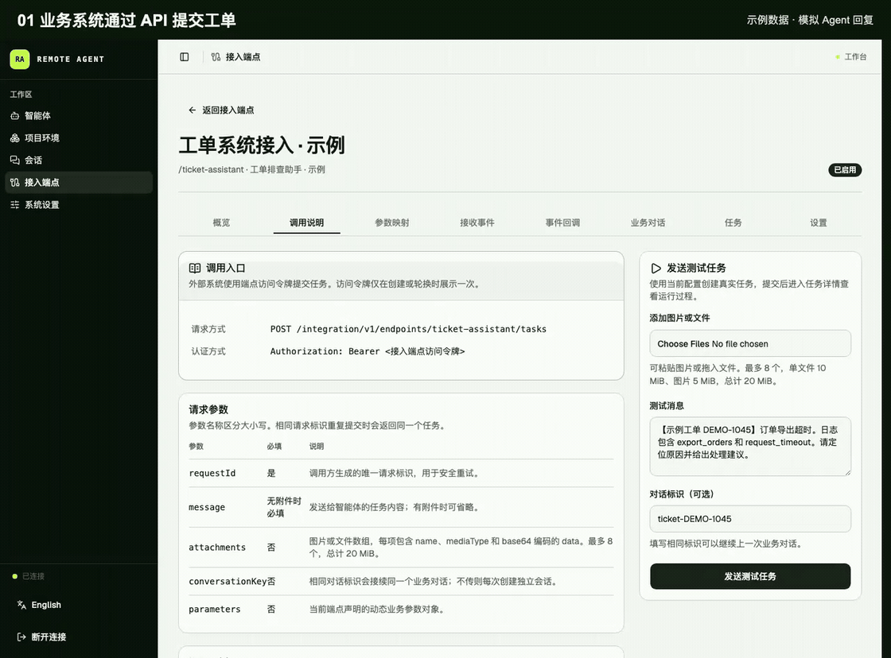
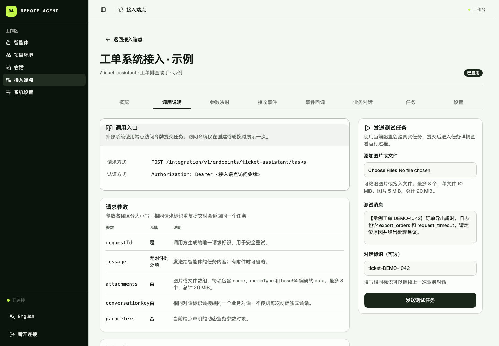
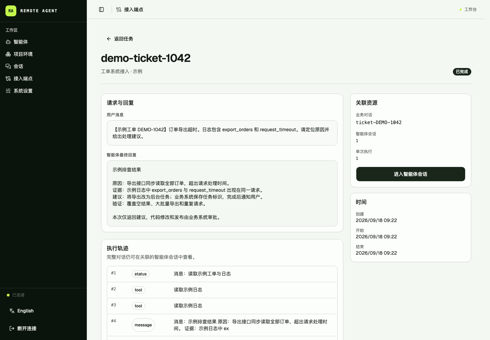
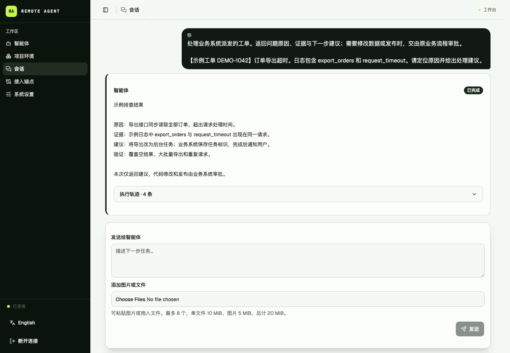

# Remote Agent Server

[English](README.en.md) · [MIT License](LICENSE) · Node.js 22 · macOS / Linux

**把 Claude Code、Codex 和 Hermes 接入你的工单、CI 和业务系统。**

在自己的机器上部署，通过 Web 管理台直接发起任务，或用 HTTP API、GitHub / GitLab Webhook 调用熟悉的命令行 Agent。Remote Agent Server 负责排队、工作区、会话和执行记录；你的系统通过查询、SSE 或签名 Webhook 取得进度与结果。

项目环境提前准备仓库和依赖，每个 Session 使用独立的写时复制 Workspace。同一会话可以继续追问，调用方断开连接也不影响已提交任务的执行。

底层是基于 [acpx](https://github.com/openclaw/acpx) 和 [Agent Client Protocol（ACP）](https://github.com/agentclientprotocol) 的自托管执行网关，支持 Skills、MCP、执行器扩展与模型策略。单个 Fastify 进程配合 SQLite WAL，无需额外部署数据库或消息队列。

[界面演示](#业务系统接入演示) · [安装并启动](#安装并启动) · [完成第一条任务](#从零完成一次-agent-执行) · [HTTP / Webhook 接入](#其他系统如何接入) · [主要功能](#主要功能) · [执行模型](#执行模型) · [配置](#配置) · [部署文档](docs/deployment.md)

## 业务系统接入演示

以工单排查为例：**业务系统通过 Task API 提交任务 → 查看状态与结果 → 打开关联会话继续处理**。



真实管理台录屏，使用合成的示例工单、工具事件和固定回复，未调用真实模型。录屏展示接口与界面流程，不代表模型排查效果或执行耗时。[查看 MP4](docs/media/business-workflow-zh.mp4) · [接入文档](#其他系统如何接入)

<details>
<summary>查看完整截图：调用入口、任务结果、会话记录</summary>

**调用入口**：查看 HTTP 接口、认证方式与参数，并在管理台试调。



**任务结果**：将业务请求、最终回复、执行轨迹和关联会话放在一起核对。



**会话记录**：查看消息和工具事件，在原有上下文中继续补充信息。



</details>

## 适用场景

| 你想做什么 | 如何使用 |
| --- | --- |
| 在浏览器里运行和继续 Agent 任务 | 用管理台准备项目环境、创建 Agent 和 Session，查看消息、工具调用与结果。 |
| 将 PR / MR 事件交给审核 Agent | 配置 GitHub / GitLab Webhook 和事件筛选；结果可查询或回调，写回评论需另配工具与权限。 |
| 让工单或运维平台派发代码排查任务 | 通过 Task API 提交日志、说明或附件，用业务会话标识继续补充信息。 |
| 在现有 Shell 脚本、CI/CD 或内部平台中调用 Agent | 用 curl 或任意 HTTP 客户端提交异步任务，保存 Task ID，轮询结果或接收回调。 |

适合已经在使用 Agent CLI，希望把它接入长期运行的业务流程的开发者和团队。首次可以只在管理台跑通一个任务，再接入现有系统；原有的脚本、CI、审批和发布流程可以继续使用。

Provider 继续负责推理、工具使用和原生会话，业务审批、工单状态机与部署规则由调用方维护。代码和运行记录由你管理，调用模型时仍遵循所选 Provider 的认证、计费与数据传输方式。当前面向可信用户的单机部署；Workspace 提供文件副本隔离，**不是容器或安全沙箱**。详见[安全边界](#安全边界)。

## 主要功能

- **异步 Task API**：外部系统通过 HTTP 提交任务，使用幂等键避免重复执行，并可查询、取消或继续多轮 Conversation。
- **可靠事件出口**：支持增量 Event 查询、可续读 SSE 和签名 Webhook；断线不影响正在执行的 Task。
- **统一管理 Agent**：集中配置 Provider、Agent 指令、项目环境、Skills 和 MCP。
- **可复用项目环境**：提前准备一个或多个 Git 仓库及依赖，Session 创建时无需重新安装。
- **隔离 Workspace**：macOS 使用 APFS Clone，Linux 使用 Btrfs Snapshot，为每个 Session 快速创建写时复制环境。
- **多轮 Agent 对话**：同一 Session 可以连续执行多个 Run，并在 Provider 支持时续接 ACP Session。
- **完整执行记录**：在 SQLite 中保存用户消息、Agent 输出、工具调用、状态、错误和最终结果。
- **Skills 管理**：发现本机 Skills、上传 ZIP 或添加 Git/marketplace 来源，预览版本变化并按 Agent 更新或回退。
- **执行器扩展**：发现 Codex 和 Claude Code 的系统插件与 Hook，由每个 Agent 单独选择，在运行时投影到它的 Provider Home。
- **MCP 管理**：支持 HTTP 和 stdio MCP，支持固定值、Session 参数和运行时参数，也可从 Provider 系统配置中导入 MCP，并查看服务器公开的工具。
- **模型策略**：自动读取 Agent Core 通过 ACP 暴露的模型，可跟随 Core 默认模型、固定模型，或按 UTC 星期和 24 小时时间段为新 Run 选择模型。
- **运行、存储与并发控制**：在管理台调整 Run 超时、空闲 Session 大文件保留期和三类服务并发，并可为单个 Agent 设置 Run 上限。
- **有头浏览器**：Agent 可以运行在真实桌面会话中，不要求放入容器。
- **GitHub / GitLab 事件接入**：原生 Webhook 验证、事件筛选、筛选预览和接收记录；与通用 Task API 共用执行流程。
- **图片与文件任务**：在管理台上传、拖入或粘贴附件，也可通过 API 提交图文或纯附件消息；内容理解取决于 Provider、模型和工具。
- **部署初始化与诊断**：`pnpm run init` 生成配置，`pnpm run doctor` 验证原生 Workspace 操作，首次使用由页面引导。

## 执行模型

外部系统接入是项目的主要服务接口：

```text
外部系统
   |
   v
接入端点（鉴权 / 参数映射 / 幂等）
   |
   v
Task -> Conversation -> Session -> 隔离 Workspace -> acpx/ACP -> Provider
   |                         |
   |                         +-> Skills / 执行器扩展 / MCP / 模型策略
   |
   +-> 状态查询 / Event 查询 / SSE / 签名 Webhook
```

管理人员也可以从 Web 界面直接创建 Session 和 Run：

```text
项目环境 -> Agent -> Session -> Run -> acpx/ACP -> Provider
                         |
                         +-> 消息、工具调用、状态和结果
```

| 对象 | 作用 |
| --- | --- |
| 项目环境 | 保存一个或多个 Git 项目及准备完成的依赖，按版本发布。 |
| Agent | 绑定 Provider、项目环境、Agent 指令、Skills、执行器扩展、MCP、模型策略和并发策略。 |
| Session | 一个隔离的 Workspace，也是一段可继续的 Agent 对话。 |
| Run | Session 中的一次输入和完整执行记录。 |
| 接入端点 | 其他系统调用服务的认证入口，绑定一个 Agent。 |
| Conversation | 外部系统的多轮业务会话，内部复用同一个 Session。 |
| Task | 外部系统提交的一次异步请求，最终对应一个 Run。 |

## 运行要求

- Node.js 22（`.nvmrc` 是项目已验证版本）
- 通过 Corepack 使用 pnpm 10
- Git
- 至少安装并登录一个 Provider CLI
- macOS 使用 APFS；Linux 使用服务用户可操作的 Btrfs
- Linux 需要安装 `btrfs-progs`，且服务用户必须能实际执行 `btrfs subvolume create/snapshot/delete`
- 需要有头浏览器时，服务器必须有真实桌面或 X display

项目环境和 Session Workspace 使用 APFS Clone 或 Btrfs Snapshot 创建写时复制副本。服务不提供普通目录复制回退。新主机请先完成[部署文档](docs/deployment.md)中的文件系统准备。

## 安装并启动

```bash
git clone https://github.com/ma-pony/remote-agent-server.git
cd remote-agent-server

nvm install
corepack enable
pnpm install --frozen-lockfile
pnpm run init
pnpm start
```

`pnpm run init` 自动生成随机 `API_TOKEN` 和权限为 `0600` 的 `.env`，创建数据目录，并实际验证工作区创建、克隆／快照、独立写入和清理。若进程环境已提供 `API_TOKEN`，则沿用该值。已有 `.env` 不会被覆盖，Token 不会被重新生成。命令只检查 Provider 可执行文件是否存在，不会登录或调用模型。

- **macOS**：默认使用 `~/Library/Application Support/remote-agent-server`，通常可直接执行以上命令。
- **Linux**：默认使用 `/srv/remote-agent`。先按[部署文档](docs/deployment.md#linuxbtrfs-原生部署)准备服务用户可写的 Btrfs 目录；也可在首次初始化时用 `pnpm run init --root /你的Btrfs目录/remote-agent` 指定一个根目录，无需分别填写四个存储路径。

检查失败时会提示原因，新安装不会写入 `.env`。修复目录权限或文件系统后重试即可；初始化不会格式化磁盘、修改挂载或使用普通目录复制回退。`--root` 只用于首次生成配置，已有安装继续使用原 `.env` 的路径。

服务自动读取当前工作目录的 `.env`，不再需要 `source`；已经设置的进程环境变量优先。文件按 dotenv 数据解析，不执行 Shell 命令，也不展开 `$HOME`、`~` 或变量引用，手工填写存储路径时使用绝对路径。

以后检查安装状态：

```bash
pnpm run doctor
```

`doctor` 检查现有配置和工作区操作，清理探测文件，不创建或修改 `.env`，不运行真实 Agent。它也支持完全由进程环境提供配置的部署；目录检查通过不代表 Provider 已登录或模型可用。

`pnpm start` 会先构建服务端和 Web 管理台，再以生产模式启动。若直接执行构建后的 Node 入口但 Web 构建不完整，服务会明确报错退出。

检查服务：

```bash
curl --fail http://127.0.0.1:3000/api/health
```

打开 `http://127.0.0.1:3000`，从 `.env` 复制 `API_TOKEN` 的值到登录页。初始化命令和启动日志不会打印 Token，Web 界面只在当前浏览器会话中保存它。新生成的配置默认只监听 `127.0.0.1`；跨机器访问可通过 SSH 端口转发，或按部署文档配置监听地址和 TLS 反向代理。

首次进入后按页面提示完成 **项目环境 → 智能体 → 会话**。尚无可用环境时，页面会直接引导创建或查看环境；环境准备好后再创建 Agent。只需先配置一个 Provider，Skills、MCP 和外部接入可在首个任务跑通后按需添加。

### 手动配置与直接启动

也可以手动管理配置。在尚无 `.env` 的新安装中执行：

```bash
cp -n .env.example .env
chmod 0600 .env
openssl rand -hex 32
```

把生成的随机值填入 `.env` 的 `API_TOKEN`，并设置当前用户可写的绝对存储路径；macOS 使用 APFS，Linux 使用 Btrfs，项目环境与 Session 根目录必须位于同一文件系统。然后检查、构建并直接运行：

```bash
pnpm run doctor
pnpm build
NODE_ENV=production node dist/server/main.js
```

服务会自动读取 `.env`，无需执行 `source`。也可以完全通过 Shell 环境变量或 systemd `EnvironmentFile` 提供配置；已有进程变量优先。常驻服务的 LaunchAgent / systemd 示例见[部署文档](docs/deployment.md)，全部变量见[配置](#配置)。

### 本地开发

初始化后直接运行：

```bash
pnpm dev
```

该命令会同时启动后端监听和 Vite 前端开发服务器。两者自动读取项目 `.env` 中的 `PORT`，进程环境中的 `PORT` 优先。Vite 默认位于 `http://127.0.0.1:5173`，并把 `/api` 和 `/integration` 自动代理到该后端端口；前端修改可热更新，无需重复构建或重启后端。

## 从零完成一次 Agent 执行

### 1. 准备 Provider

Provider CLI 必须由运行服务的同一个操作系统用户安装并登录。安装和认证方式以官方文档为准：

- [Claude Code](https://code.claude.com/docs/en/getting-started)
- [Codex CLI](https://developers.openai.com/codex/cli)
- [Hermes Agent](https://hermes-agent.nousresearch.com/docs/getting-started/quickstart/)

下面是命令参考，只执行所选 Provider 对应的命令：

```bash
claude auth login
codex login
claude auth status
codex login status
claude --version
codex --version
hermes --version
```

只需选择实际使用的 Provider，在运行服务的系统用户下完成认证和模型配置。

服务启动时读取登录 Shell 的 PATH，并合并当前 Node 目录和进程 PATH。每个 Agent 使用独立的 Provider Home。服务会从运行用户的 Provider Home 准备基础配置、认证与模型信息，不复制历史会话、日志和临时运行数据。Codex 和 Claude Code 的系统插件、Hook 与全局 MCP 只作为可选配置来源，不会被 Agent 隐式继承。

### 2. 创建项目环境

进入 **项目环境 → 新建项目环境**：

1. 添加 Agent 可能使用的一个或多个 Git 仓库。
2. 为每个仓库填写可选的准备命令，例如 `pnpm install`、`bundle install` 或 `uv sync`。
3. 点击 **立即同步**。
4. 等待当前版本变为 **可用**。

同步会在持久目录中构建新版本。所有仓库及准备命令成功后，新版本才会发布。系统每 3 小时检查一次远程仓库，也可以手动同步。已有 Session 保持原版本，新 Session 使用最新可用版本。Session 直接使用当前版本的 APFS Clone/Btrfs Snapshot，不重复执行清理或准备命令；旧 Session 在首次继续运行时仍会完成一次兼容修复。

项目包含 `uv.lock` 时，服务会在原准备命令前先执行 `uv venv --relocatable .venv`，之后项目原有的 `uv sync` 或 Make 命令会复用这个可迁移环境。服务器需要安装 uv `>= 0.10.8`；升级后需要重新同步项目环境，已有 `.venv` 不会自动转换。同步时会比较 `uv.lock`、`pyproject.toml` 和 `.python-version`：依赖未变只更新源码，依赖变化才清理并重新准备该项目。项目环境只保留当前 Workspace；Session 使用自己的 Btrfs 快照，不依赖旧项目环境 Workspace。

### 3. 创建 Agent

进入 **Agent → 新建 Agent**：

1. 选择 Claude Code 或 Codex 等 Provider。
2. 选择已经可用的项目环境。
3. 填写 Agent 的职责、代码规范和交付要求。
4. 保存后运行 **运行检查**，确认 Provider 和项目环境可用。

### 4. 创建 Session 并发送消息

进入 **Session → 新建 Session**，选择 Agent，并填写当前 Session 需要的 MCP 参数。系统从项目环境当前版本创建独立 Workspace。

进入 Session 后发送消息。系统创建 Run 并排队执行，页面会展示 Agent 输出、工具调用、执行状态、错误和最终结果。

在同一 Session 中继续发送消息会创建新的 Run，并在 Provider 支持时续接同一个 ACP Session。每个 Run 仍保留独立的输入、事件和结果。

第一次可以用一个容易核对结果的任务：

```text
阅读当前项目，说明目录结构、启动方式和测试命令。先不要修改文件。
```

## Agent 配置与运行策略

Agent 页面还可以配置：

- **Skills**：发现本机 Skill、上传 ZIP，并明确启用需要的 Skill。
- **执行器扩展**：查看当前 Provider 系统配置中发现的插件和 Hook，并为这个 Agent 启用需要的项。
- **MCP**：添加 HTTP 或 stdio MCP，检查连接并查看工具；也可将 Codex 或 Claude Code 的系统全局 MCP 导入当前 Agent。
- **运行并发策略**：默认继承系统 Run 并发，也可以设置当前 Agent 的独立上限；实际上限取两者较小值。
- **模型策略**：模型列表来自当前 Agent Core，不允许手填未配置的模型。可以跟随 Core 默认模型、固定一个模型，或按 UTC 星期和 24 小时时间段切换；Core 未暴露模型列表时后两项不可用。

模型策略在 Run 离开队列、真正开始执行时解析，因此排队时间不会导致提前选错模型。切换复用同一个 Session 和 Provider 对话上下文，只更新 ACP `model` 配置；不会中断正在执行的 Run，下一次 Run 才使用新模型。固定或定时策略会在每个 Run 上记录实际解析出的模型，便于审计。

### 模型策略速查

进入 **Agent → 目标 Agent → 设置 → 模型策略** 配置：

| 模式 | 行为 | 适合场景 |
| --- | --- | --- |
| 跟随 Agent Core 默认模型 | 使用 Core 当前公开的默认模型。 | 由 Codex、Claude Code 等 Core 统一管理模型。 |
| 固定模型 | 每个新 Run 都选择同一个模型。 | 一个 Agent 需要稳定使用指定模型。 |
| 按 UTC 规则切换 | 同时命中星期和时间段时使用其模型，其他时间使用兜底模型。 | 工作日/周末使用不同模型，或按模型可用时段、成本和吞吐策略自动切换。 |

管理台按规则组配置：每组统一选择一个或多个 UTC 星期、一个模型和可选的 Run 并发上限，组内可添加多个 24 小时制 `HH:mm` 时间段，例如工作日 `08:00–10:00` 和 `14:00–18:00` 共用同一模型与并发。开始时间包含、结束时间不包含；结束早于开始时自动跨到下一 UTC 日，所选星期表示时间段的开始日。规则组重叠时配置靠前的优先。并发留空时继承 Agent 平时的并发策略，填写后覆盖 Agent 上限但仍不超过系统全局上限。页面提供“工作日 / 周末 / 每天”快捷选择，未命中的时间使用兜底模型和默认并发。保存时服务会重新读取 Core 模型目录，并拒绝已经不在目录中的模型。

策略修改只影响之后真正开始的 Run：正在执行的 Run 不切换，仍在队列中的 Run 会在获得执行槽位时按当时 UTC 时间解析。Session、Workspace 和 Provider 对话上下文都会继续复用。服务解析出明确模型时，Session 页面会在 Run 上展示它，管理 API 也会在 `resolvedModel` 字段中返回；完全跟随且 Core 未公开默认模型时，该字段为 `null`。接口配置格式与解析顺序见[产品与架构：模型发现、策略与审计](docs/design.md#62-模型发现策略与审计)。

Skills、执行器扩展和 MCP 的变更从下一次 Run 生效。已有 Session 检测到配置变化后会刷新执行器连接；Provider 支持时，会继续原有 Provider Session 和对话上下文。

在 Agent 的 **Skills** 页面管理共享 Git 来源，可填写 GitHub、GitLab 或其他 Git 服务的 HTTPS/SSH 地址，以及可选分支、标签、提交 SHA 和仓库子目录。支持普通 Skills 仓库、Claude 的 `.claude-plugin/marketplace.json`、Codex 的 `.agents/plugins/marketplace.json`，以及 `plugin.json`、`.codex-plugin/plugin.json` 和 `.claude-plugin/plugin.json` 中的 Skills 声明。marketplace 的本地目录和 Git 插件源会解析为完整包快照；不支持的条目会显示提示。导入只提供 Skills，不执行插件 Hook、MCP 或依赖安装命令。

版本预览先列出变化文件、大小和权限，点击文件的“查看差异”后才加载文本变更片段。每个文件的当前和目标内容分别支持最多 1 MiB 的 UTF-8 文本，差异最多显示 64 KiB，超出时明确提示截断；文件之间不共用预览额度。二进制、非 UTF-8 和超限文件分别说明原因，仍保留文件变化信息。预览期间内容发生变化时，需要重新点击“预览变更”。

手动刷新来源只发现新版本。已启用的 Agent 保持原版本；在版本预览中检查文件变化，再明确应用到当前 Agent，也可以选择历史版本回退。同名上传 ZIP 可作为原 Skill 的新版本发布，发布后仍需单独应用。版本摘要覆盖整个包的文件内容和可执行权限，修改 scripts、references 也会被识别。重复启用已启用的 Skill 不会更新版本，本地副本有修改时会阻止覆盖。移除 Git 来源保留已启用副本和版本历史；不同 Agent 的选择互不影响。

每次 Run 使用自己的 Session 投影，运行中的任务保留原内容。Run 管理 API 的 `skillsRevision` 记录实际投影的摘要；升级前的历史 Run 为 `null`。来源管理及版本接口使用同一个管理 API Token，详见[能力投影设计](docs/design.md#8-agent-能力投影)。

2026-09-14 的[验收记录](docs/superpowers/validation/2026-09-14-skill-source-updates.md)确认了真实 Git 来源导入和 Codex `gpt-5.5` 的读取、更新、回退及会话连续性。GitLab 实测覆盖仓库拉取；Claude Code 和 Hermes 的真实执行分别被上游模型权限和通道可用性阻塞，尚未完成验收。

已知运行时限制：部分 Provider 会把上游模型错误作为普通回复返回，同时报告运行完成。验收时需要检查实际回复和预期产物，不能只看 Run 状态。此错误状态传递问题尚未修复，排查方法见[部署文档](docs/deployment.md#provider-验收与已知限制)。

执行器扩展遵循“发现 → Agent 选择 → 运行时投影”流程。在服务运行用户的 Codex 或 Claude Code 配置中安装新插件、添加 Hook 后，它们会出现在 Agent 的 **执行器扩展** 页面，默认不启用。启用的项只投影到当前 Agent。Hermes 目前不提供这项扩展管理能力。

Codex 插件按 Agent 发布为本地 marketplace 快照；选择与内容版本相同的 Session 共用插件缓存。默认情况下，同一 Agent 的 Session 也共用内置市场同步目录；显式启用 Codex rollout 压缩的 Session 保留独立 `.tmp`，使各自的压缩锁互不影响。插件选择变化在下一次 Run 生效；包文件变化在发现缓存刷新后生效（默认最多 30 秒）。已有 Session 的旧插件缓存与临时克隆在下一次准备运行目录时清理，空闲 Session Home 仍按原保留策略清理。Claude Code 的插件投影暂保持现状。

Provider 系统全局 MCP 使用独立流程：在 Agent 的 **MCP** 页面选择“导入并启用”后，系统把当前配置复制为 Agent 自己的 MCP。后续可以在 Agent 中单独编辑、检查、限制工具范围或删除，不会直接修改 Provider 的系统配置。MCP 值可以来自固定配置、创建 Session 时提供的参数，或 `agent_id`、`session_id`、`run_id`、`workspace_path`、`browser_profile_path` 等运行时值。敏感值加密保存，管理接口不返回明文。

### 运行与并发

进入 **系统设置 → 运行与并发**，可以在线调整：

- 单个 Run 的硬超时；
- 空闲 Session 大文件的保留时间；
- 全局 Run 并发；
- Webhook 投递并发；
- 项目环境构建并发。

设置保存在数据库中。Run 超时作用于新启动的 Run；存储保留期在下一次清理时生效；并发修改立即作用于后续调度。提高上限会继续派发排队工作，降低上限不会取消正在运行的工作。系统始终保证同一 Session 的 Run 串行、同一外部 Conversation 复用同一 Session 且串行、同一 Webhook 订阅按顺序投递，并合并同一项目环境的重复同步请求。

服务启动时会立即执行一次存储清理，之后每 10 分钟检查一次。保留期按 Session 的最后活动时间计算，服务重启不会重新计算已空闲 Session 的保留期。达到保留期的空闲 Session 会删除 Workspace、浏览器数据、Provider 原生会话，以及该 Session 下所有 Task 的 Webhook 投递记录（含等待、投递中和已结束记录）；清理后不再重试这些投递。Session、Run、Task/Conversation 关联和 Token 统计继续保留；原始消息／工具事件另按下文的用量事件保留期处理。不关联 Task 的测试投递不受 Session 清理影响，重置 Provider 上下文也不删除投递记录。

删除前会再次检查 Session 是否仍然到期。清理或删除失败时，Session 保持占用，防止使用已被部分删除的 Workspace；自动清理会在后续轮次重试，手动删除可以重新调用删除接口。关闭自动清理会停止接收新的清理任务，已经开始的清理仍会完成。服务重启会先恢复未完成的清理、删除或重置，再调度 Run。

这些上限控制当前 Remote Agent Server 进程。项目当前按单进程部署设计，不提供跨多个服务实例的分布式并发配额。

### 用量分析

能力维度默认选择“全部能力”，统一分析 MCP 工具、内置工具、CLI、Skill、插件、Hook、未知工具，以及用户提示词、配置的指令、模型请求中的系统提示词、模型回复、已观测思考内容五类细分内容。每类都能单独筛选、排名并查看证据。配置指令每 Run 计一次，回复按已持久化文本片段计量；内容观测次数与工具执行次数分开显示。累计输入默认通过原生会话日志重建，也可采用直接请求采集；不能与运行中观测的一次性内容量相加。

通过执行器扩展启用的原生插件，其实际投影的 Skills 也进入归属映射。Claude 日志中由 `Skill` 调用注入的指令正文归入对应 Skill／插件，并随每次后续请求累计，不计作用户提示词。

管理台动态资源列表、选择器和历史记录使用分页或按需加载。翻页只读取当前页，跨页选择和参数编辑保留已选资源与已输入值；任务与会话事件按序号增量读取。统计卡片仍表示完整筛选范围，列表翻页不改变统计口径。

侧栏、Agent 和 Session 页面提供“用量分析”入口，可按 Agent、Session、日期及 Runtime 查看已知模型用量，并按具体 MCP Tool、CLI、Skill、插件查看调用和内容估算。默认排名对照一次性内容量与直接采集或日志重建的累计输入占用，分别列出定义、参数及首次／重复结果；同一内容进入多个请求会逐次计入。Codex／Claude Code 默认从原生会话日志重建请求上下文，包含日志中可见的推理正文，累计重复输入，无需配置 HTTP 转发；页面标注“会话重建估算”，并对照相同请求的上报输入与归因差额。原生日志未暴露的请求包装及内部工具定义仍留在差额中。仍可切换“观测内容”查看一次性参数和结果估算。已知模型首次计量时自动获取并缓存固定版本官方词表，手动配置优先；获取失败时自动重试并等待词表补算，未知模型使用明确标注的多语言兜底估算，缓存子集和重叠能力视角不重复相加。

托管的 Codex／Claude Code 日志补充 Runtime 证据，启动恢复和关闭时补采，MCP 观察器记录执行事实。配置 `USAGE_CAPTURE_UPSTREAMS` 后可自动采集支持的 API-key 模型请求，查看具体工具定义、结果首次／重复输入及 Skill／插件归属；也可手动导入通用“上下文快照（Context Snapshot）”。上报用量、实际执行与上下文证据分别计量，不要求外部遥测平台。Reset 和存储清理前先采集，保留历史统计；显式删除 Session 清除对应统计并拒收迟到重放。

启动后后台分批回补已有 Run 中保留的工具事件，页面显示进度与缺口；恢复原事件日期，重启不会重复累加。计数与游标按批提交，批次之间主动休息，停止后从已提交进度继续；单条大记录仍可能超过软时间预算。CLI 支持结构化参数和可确定的单条 Shell 命令，包括常见 env／rtk／shell 包装；管道、组合命令和动态展开保留为 Shell。明确读取已投影 Skill 文件或执行其脚本时记录 Skill／插件归属，仅目录可见不计为使用。

汇总、排名、趋势和来源独立展示，慢请求不会挡住其他已加载区域。排名切换与翻页独立刷新，先按所选指标排序分页，再读取当页完整指标；日期筛选和输入证据分页在数据库侧收窄范围，首次／重复归因仍基于完整历史。相同范围的汇总与趋势共享一次账本读取和核对，统计结果使用有界缓存，数据库写入后失效；仍需读取所选主体的历史计量元数据以核对累计总量和未归位用量。后台恢复期间只轮询轻量状态，数据变化才刷新统计，隐藏页面暂停轮询。托管 JSONL 日志流式读取并只解析新增记录，不再受整文件 16 MiB 限制；单行仍有上限，未写完的行保留为待重试采集。

数据来源列表和采集状态轮询遵循当前 Agent／Session 筛选；切换能力或关闭证据抽屉会取消旧详情请求，重新打开从第一页开始。

文件数据库的汇总、趋势和能力排名通过独立只读 Worker 查询，共用有界队列和结果缓存，避免重聚合阻塞管理 API。新增对话计量仅引用共享词表元数据。Run 结束满 7 天后，统计与词表补算已完成、无空计数且 Session 空闲时，后台分批清理原始消息分片和工具正文；每步只检查一个 Run，`/api/usage/status` 可查看进程内清理进度与跳过原因。最终回复、计数、排名及关联继续保留，页面显示原始事件已过期。`USAGE_EVENT_RETENTION_DAYS=0` 可关闭这项清理，与 Workspace 保留期独立。清理后的正文不能用于未来词表重算，已有估算保留原来源；释放的 SQLite 页可复用，文件不会立即缩小。

Agent 详情、Session 详情和会话列表的累计数字统一读取 `/api/usage/*` 新账本；会话列表按当前页批量查询。旧 Session 累计字段和 `/api/agents/:id/usage` 已停用，单次 Run 的用量记录继续保留。来源边界、缺失说明、快照格式及可执行接入示例见[用量分析指南](docs/agent-usage.md)。

## 其他系统如何接入

外部接入是异步接口。调用方提交 Task 后立即得到 `202 Accepted`，不需要等待 Agent 完成，也不需要长期保持 SSE 连接。

### GitHub / GitLab 原生 Webhook

在管理台打开 **接入端点 → 接收事件**，选择 GitHub 或 GitLab 和验证方式，填写 Webhook Secret 并保存。把页面提供的接收地址和相同 Secret 填入平台的 Webhook 设置，选择需要触发的事件即可，无需自定义请求头或请求体。

```text
POST /integration/v1/endpoints/:slug/webhook
```

| 平台 | 平台侧配置 | 服务端验证 |
| --- | --- | --- |
| GitHub | Payload URL、Secret；支持 JSON 和表单 `payload` | 原始请求体的 `X-Hub-Signature-256` HMAC-SHA256 签名 |
| GitLab | URL、生成的 Signing token（`whsec_` 开头）；旧版可用 Secret token；保留默认 JSON | `webhook-signature` HMAC-SHA256 签名，或旧版 `X-Gitlab-Token` |

解析器升级不会自动重放未变化的历史 Codex 日志。需要修正已结束会话的旧估算时，可对对应来源调用 `POST /api/usage/sources/:id/collect` 并传入 `{"rebuild":true}`；重建只更新该来源的上下文估算，不重复累计模型上报用量。操作和状态检查见[用量分析指南](docs/agent-usage.md)。

每个端点配置一个来源平台；可分别创建 GitHub 和 GitLab 端点并绑定同一 Agent。业务规则写在端点的固定提示中，例如“检查这次代码变更并给出审查结论”。事件类型和原生 JSON 载荷作为任务正文，进入现有 Task 入库、排队和执行流程。默认将同一 MR / PR 的命中事件在 60 秒静默期后合并为一个 Task 和 Session；其他事件或关闭合并时逐次创建。不会自动按 PR、MR 或分支续接 Conversation。

- 验证并立即入库成功返回 `202` 和现有 Task 响应；等待合并时返回下文的 pending 响应。GitHub `ping` 返回 `200`、`{"status":"ignored","reason":"ping"}`，不创建任务。GitLab 的测试投递也经过筛选，命中时创建任务。
- 未合并事件的 `requestId` 自动生成为 `github:<X-GitHub-Delivery>` 或 `gitlab:<投递ID>`。GitLab 按 `webhook-id`、`Idempotency-Key`、`X-Gitlab-Webhook-UUID` 的顺序读取投递 ID。同一端点重投相同 ID、相同输入返回原 Task 或待派发批次；输入不同返回 `409 idempotency_conflict`。
- 旧版 GitLab 的 Token 模式在上述三个 ID 头全部缺失时，自动以平台、事件类型和解析后重新序列化的完整载荷计算 SHA-256，生成 `sha256:<摘要>` 投递 ID，无需自定义请求头。JSON 缩进不影响去重；事件类型或载荷变化会产生新 ID。同一端点内容完全相同的独立事件也会被视为重投，沿用首次筛选决定或返回原 Task。
- 参数映射的“请求字段”在此入口中表示载荷路径，例如 GitLab 的 `project.id`、`object_attributes.iid`，或 GitHub 的 `repository.full_name`。字符串、数字、布尔值转换成字符串；固定值映射继续适用。缺少必填参数会拒绝入库。
- 未配置接收器或凭证错误返回 `401 invalid_webhook_credentials`；接收器或端点停用返回 `403 endpoint_disabled`；缺少事件类型或 GitHub 投递 ID、载荷不是有效 JSON 对象，或 GitLab 已提供的 ID 头均无有效值时，返回 `400 invalid_webhook_request`。GitLab 签名模式仍要求有效的 `webhook-id`，缺失时验证失败返回 `401`。请求体沿用服务默认的 1 MiB 上限，超出返回 `413`。
- `authMode` 必填：GitHub 使用 `signature`；GitLab 可选择 `signature`（Signing token）或 `token`（Secret token），验证方式由配置决定。签名模式下 GitLab 的 `whsec_` Signing token 按原生标准校验投递 ID、时间戳和原始请求体；接受多个候选签名，时间戳与服务时间相差不得超过 5 分钟。该模式必须带有效签名，不能用明文 Token 代替。Token 模式支持任意合法 Secret token，包括以 `whsec_` 开头的值。
- Secret 加密保存，读取配置只返回 `secretConfigured`。更新时省略 `secret` 保留原值；切换平台或验证方式必须提供新 Secret。接收 Secret 与外部 Task API 的 Endpoint Token、事件回调签名密钥分别管理。

管理 API 使用服务器 `API_TOKEN`。`GET /api/integration-webhook-providers` 返回已注册平台、验证方式、配置提示、筛选字段及预设，供管理页面使用。接收配置接口：`GET /api/integration-endpoints/:id/webhook-receiver` 返回配置或 `null`；`PUT` 在同一地址保存以下配置：

```json
{
  "provider": "github",
  "authMode": "signature",
  "enabled": true,
  "secret": "<与平台设置一致的 Secret>"
}
```

#### 合并短时间内的 MR / PR 事件

为避免“加审核标签”和“推送新提交”几乎同时发生时审核两次，默认开启 **60 秒** 事件合并。可在 **接收事件 → MR / PR 事件合并等待（秒）** 调整，填 **0** 可关闭。该设置独立于筛选规则，保留已有标签、作者和动作限制即可。

- `debounceSeconds` 为 0–300 的整数，默认 `60` 开启；旧数据库首次增加此字段时也使用 60。已经保存的值（包括明确关闭的 `0`）保持不变。相同平台更新时省略该字段保留原值，切换平台时省略则恢复为 60。
- 先验签、去重和筛选，再按“接入端点 + 平台 + 仓库所在站点与 ID + MR / PR 编号”合并。每个新的命中事件重置静默期，合并等待最长 5 分钟；重复投递和未命中事件不更新载荷、不延长等待，也不撤销已经接收的事件。
- 窗口内只保留最后收到的命中事件载荷和映射参数，窗口结束后创建一次 Task / Session。它不比较提交版本或读取平台最新状态，也不撤回已开始的审核；窗口结束后到达的新事件进入下一批。
- GitLab 仅合并 `Merge Request Hook` / `merge_request`，GitHub 仅合并 `pull_request`。其他事件或缺少有效仓库站点、ID、MR / PR 编号时仍立即入库，避免误合并或丢事件。
- 等待中的投递返回 `202` 和 `{"status":"pending","batchId":123,"scheduledAt":"2026-09-18T00:01:00.000Z"}`，此时还没有 Task / Session；派发后重投返回该批次的 Task。接收记录保留每条投递，展示等待或自动重试状态，派发后链接同一 Task。
- 待派发载荷加密持久化，服务重启继续处理。任务入库失败每 30 秒自动重试，使用同一请求标识防止重复创建；任务入库后清除临时载荷。接收器或端点停用、或接收器切换到其他平台时暂停旧批次派发，恢复原平台并启用后继续。已入库任务不受影响；将合并时间改为 0 仅影响新事件，已接收批次继续处理。

通过接收配置 `PUT` 接口保存 `"debounceSeconds": 0` 可关闭，保存 `60` 可重新启用；同平台更新可省略 `secret` 和 `filter` 以保留原配置。筛选预览只检查规则是否命中，不创建或展示合并批次。

#### 事件筛选

在“接收事件”中应用审核预设，再添加项目、作者等条件。选择“满足全部条件”表示 AND，“满足任一条件”表示 OR；条件组可以嵌套。**MR / PR 审核事件** 预设选择非草稿且仍开启的请求：新建、重新开启、新提交或转为可审核。普通标题、描述、指派、标签、审批等更新不会触发该预设；未知草稿状态也不放行。

按标签控制审核时，选择 **按标签审核 MR / PR** 预设。它要求当前标签包含 `CodeReview` 且不含 `Done-Pass`，除上述审核事件外，还接收新增 `CodeReview` 或移除 `Done-Pass` 后开始满足标签条件的事件，避免创建时没有标签、后补标签却漏审。添加或删除其他标签、编辑描述及勾选任务清单不会触发。GitLab 使用 `changes.labels.previous` 判断此前是否不满足条件；缺少该字段时不推断标签变化。GitHub 使用 `labeled` / `unlabeled` 动作及本次变动的 `label.name`。仍带 `Done-Pass`、缺少 `CodeReview`、已关闭或草稿中的请求不通过。

预设是可编辑模板，已有接收器配置不会自动升级。应用预设会替换编辑器当前规则，保存前重新补入项目和作者限制；如需更换标签名称，应同时修改当前标签条件和标签变化条件里的对应值。实际新提交仍会命中；预设只负责筛选，是否合并由独立的事件合并等待设置决定。

例如，在 **按标签审核 MR / PR** 预设最外层的“满足全部条件”中追加以下条件，排除作者 ID 为 `900` 的 GitLab MR：

```json
{
  "field": "payload.object_attributes.author_id",
  "op": "neq",
  "value": 900
}
```

以上是要追加的单条条件，完整预设及追加条件共同作为接收配置的 `filter` 保存。通过 API 配置时，可从平台目录取得 `filterPresets` 中 `label-code-review` 的 `filter`，向其顶层 `all` 追加条件后保存。GitHub 标签路径为 `payload.pull_request.labels.*.name`；作者账号可用 `payload.pull_request.user.login`。GitLab 原生 MR 事件使用 `payload.object_attributes.author_id`；`payload.user.id` 是事件操作者，不能替代作者。GitHub 的 `payload.sender.id` 同样是操作者。只审核开发人员 MR 时，建议为作者 ID 配置 `in: [101,102]` 白名单；也可用 `not_in` 维护完整的 Agent ID 黑名单。示例 ID 需替换为实际账号 ID。

需要比较两个字段时，在“等于 / 不等于”下将“比较对象”切换为“另一个字段”，填写路径，无需 JSON 引号。API 用 `valueField` 替代 `value`，两者不能同时提供；仅支持 `eq` / `neq`。两侧只比较同类型标量（字符串、数字、布尔值或 `null`），缺失、类型不符、数组或对象均不匹配。

例如，只处理创建者本人操作的 MR 评论，且 MR 仍开启、带 `CodeReview` 而不带 `Done-Pass`：

```json
{
  "all": [
    {"field": "eventType","op": "eq","value": "Note Hook"},
    {"field": "payload.object_kind","op": "eq","value": "note"},
    {"field": "payload.object_attributes.noteable_type","op": "eq","value": "MergeRequest"},
    {"field": "payload.object_attributes.system","op": "eq","value": false},
    {"field": "payload.merge_request.state","op": "eq","value": "opened"},
    {"field": "payload.merge_request.labels.*.title","op": "contains","value": "CodeReview"},
    {"field": "payload.merge_request.labels.*.title","op": "not_contains","value": "Done-Pass"},
    {"field": "payload.user.id","op": "eq","valueField": "payload.merge_request.author_id"}
  ]
}
```

这是独立的评论筛选示例；如需同时接收原有 MR 事件，可与 MR 预设用 `any` 组合，并分别保留项目和作者账号限制。先在 GitLab 项目 Webhook 中订阅 **Comments**，再用实际 `Note Hook` 载荷预览。按 [GitLab 官方评论事件示例](https://docs.gitlab.com/user/project/integrations/webhook_events/#comment-on-a-merge-request)，MR 作者路径是 `payload.merge_request.author_id`；评论事件的 `payload.object_attributes.author_id` 则是评论作者，不能用于排除 Agent 创建的 MR。`payload.user.id` 是本次事件操作者；评论编辑也可能触发事件，如仅需新评论，应在确认实际版本提供该字段后加 `payload.object_attributes.action == "create"`。评论事件不属于 MR / PR 合并范围，命中后立即创建任务。

- 字段比较沿用相同路径限制；预览的对应 `checks` 条目增加 `valueField` 并展示两侧路径，不返回解析出的比较值。已有固定值规则保持原义，`value: "payload.user.id"` 仍表示字符串。
- 字段只允许 `eventType` 或 `payload.` 开头的点分路径；一个路径最多允许一个 `*`，用于提取数组元素，如 `labels.*.title`。不读取请求头或执行脚本。
- `eq` / `neq` 比较单个标量；`in` / `not_in` 判断标量是否属于配置列表；`contains` / `not_contains` 判断事件数组是否包含 / 不包含配置标量，适合标签。界面中选择“列表不包含”，比较值填写单个 JSON 值，例如 `"Done-Pass"`，不能填数组。`not_in` 不能代替数组排除条件。`exists` 的布尔值指定字段必须存在或缺失，通配路径以至少一个元素存在目标字段为准，空数组或所有元素均缺失该字段时视为不存在。字符串精确匹配、区分大小写。
- 不做类型转换：数字 `101` 不等于字符串 `"101"`。字段缺失或类型不符时比较不匹配，负向比较也不放行。`null` 是已存在的值。空数组不能命中 `contains`，但能命中 `not_contains`；若同时要求包含 `CodeReview`，空数组仍不通过组合规则。`not_contains` 要求数组所有元素均存在且与比较值同类型，通配路径中任一元素缺少目标字段也不会放行。
- 规则最多 50 个节点、6 层嵌套，组不能为空；列表最多 100 个同类型标量；字段路径最多 256 字符，比较字符串最多 1024 字符。无效规则返回 `400 invalid_request`，保留原配置。
- 同平台更新省略 `filter` 保留规则，传 `null` 清除规则；切换平台且省略 `filter` 时清除规则。管理界面切换平台会清除当前筛选草稿，保存前应为新平台重新设置规则。读取配置返回 `filter` 和 `filterVersion`，规则或平台变化时版本递增。旧配置默认不筛选。
- 未命中返回 `200 {"status":"ignored","reason":"filter_not_matched"}`，不创建 Task、Session 或 Run，也不调用模型。认证失败不写接收记录。
- 每个已认证且有效的投递保存一次筛选决定。相同平台、端点、投递 ID 的重试沿用首次决定；修改规则不会重新放行已忽略事件。沿用相同 ID 却改变事件内容返回 `409 idempotency_conflict`，已接收事件重试返回原任务。旧版 GitLab 自动生成的 ID 随内容变化，因此标签等载荷字段变化后会重新评估筛选。认证及启用状态仍在每次请求时检查。

**预览筛选**使用当前尚未保存的规则，展示是否命中及逐条条件原因，不验证平台签名、不创建任务、不保存示例载荷。**最近接收记录**按需刷新最近 30 条，展示平台、事件类型、投递 ID、规则版本、筛选决定、时间和关联 Task。筛选通过但入库失败时显示等待平台重试；记录不包含原始载荷或认证信息。已保存的决定保留到端点删除，不随 Session 存储清理删除。

管理 API：

- `POST /api/integration-endpoints/:id/webhook-receiver/preview`，请求为 `{ "provider": "gitlab", "eventType": "Merge Request Hook", "payload": {}, "filter": null }`，返回 `{ "matched": true, "reason": "filter_matched", "checks": [] }`；预览通过仍不保证真实投递通过认证、启用状态和参数验证。
- `GET /api/integration-endpoints/:id/webhook-receiver/receipts`，返回最近 30 条筛选记录；需要管理鉴权。平台目录同时提供 `filterFields` 字段提示和 `filterPresets` 预设。

筛选只控制是否启动任务；不同投递 ID 的相同 MR 版本不会自动去重，审核评论去重和写回仍由审核 Skill / Agent 负责。

接收成功后在端点的“任务”页查看执行情况。事件回调仍用于向外发送任务进度和结果；自动写回 GitHub/GitLab 评论需要另行给 Agent 配置相应工具和权限。

协议参考：[GitHub 验签](https://docs.github.com/en/webhooks/using-webhooks/validating-webhook-deliveries)、[GitLab Webhook](https://docs.gitlab.com/user/project/integrations/webhooks/)。

### 通用 Task API 接入流程

完整流程：

1. 管理员创建接入端点并保存一次性 Token。
2. 外部系统提交 Task，保存返回的 `taskId`。
3. 外部系统查询 Task，直到进入终态。
4. 通过 Event 查询或 Webhook 取得 Agent 回复。
5. 使用相同 `conversationKey` 继续多轮；不再续接时结束 Conversation。

下面的示例使用 `http://127.0.0.1:3000`。

### 1. 创建接入端点

管理操作使用服务器 `API_TOKEN`：

```bash
export REMOTE_AGENT_URL=http://127.0.0.1:3000
export API_TOKEN='<服务器 .env 中的 API_TOKEN>'
export AGENT_ID='<已经通过运行检查的 Agent ID，正整数>'

curl --fail-with-body \
  -X POST "$REMOTE_AGENT_URL/api/integration-endpoints" \
  -H "Authorization: Bearer $API_TOKEN" \
  -H 'Content-Type: application/json' \
  --data "{
    \"name\": \"工单处理入口\",
    \"slug\": \"ticket-agent\",
    \"agentId\": $AGENT_ID,
    \"enabled\": true,
    \"promptPrefix\": \"请按项目规范处理以下请求。\",
    \"parameterMappings\": []
  }"
```

响应包含接入端点和只展示一次的 Token：

```json
{
  "endpoint": {
    "id": 1,
    "name": "工单处理入口",
    "slug": "ticket-agent",
    "agentId": 1,
    "enabled": true,
    "promptPrefix": "请按项目规范处理以下请求。",
    "parameterMappings": []
  },
  "token": "ras_..."
}
```

立即把 `token` 保存到调用方的 Secret 管理系统：

```bash
export ENDPOINT_TOKEN='<创建端点时返回的 ras_...>'
```

服务端只保存 Token 哈希，离开创建结果后无法找回。外部系统使用 Endpoint Token，不能使用管理端 `API_TOKEN`。

`promptPrefix` 会作为普通文本加到每次外部消息之前，不是 ACP 原生 system prompt。如果 Agent 定义了必填 Session 参数，需要在 `parameterMappings` 中把它映射为请求参数或固定值：

```json
[
  {
    "parameterKey": "ticket_id",
    "source": "request",
    "requestKey": "ticketId"
  },
  {
    "parameterKey": "region",
    "source": "fixed",
    "value": "sg"
  }
]
```

### 2. 提交异步 Task

```bash
curl --fail-with-body \
  -X POST "$REMOTE_AGENT_URL/integration/v1/endpoints/ticket-agent/tasks" \
  -H "Authorization: Bearer $ENDPOINT_TOKEN" \
  -H 'Content-Type: application/json' \
  --data '{
    "requestId": "ticket-1332-event-1",
    "conversationKey": "ticket-1332",
    "message": "分析失败原因，修改代码并返回验证结果。",
    "parameters": {}
  }'
```

响应状态为 `202`：

```json
{
  "taskId": 101,
  "requestId": "ticket-1332-event-1",
  "conversationKey": "ticket-1332",
  "sessionId": 21,
  "runId": null,
  "status": "queued"
}
```

`runId` 在 Task 刚入队时可能为 `null`，调度器创建 Run 后会出现在后续查询中。

- `requestId`：调用方生成的幂等键。完全相同的输入重试会返回原 Task；相同 `requestId` 携带不同输入会返回 `409 idempotency_conflict`。
- `conversationKey`：可选业务会话标识。相同 Key 的后续 Task 严格串行，并复用同一个 Session。
- `message`：本次发送给 Agent 的正文；提供附件时可省略或为空。
- `attachments`：可选的图片或普通文件数组，格式见下文。
- `parameters`：只允许提交端点已经声明的动态参数。

#### 图片与文件附件

管理界面的会话输入框和接入端点“发送测试任务”均可选择或拖入文件、粘贴图片，发送前可预览和移除。支持纯附件消息和图文混合消息；失败后保留草稿。历史记录可预览图片或下载原文件。

HTTP 接入 API 在原请求上增加可选的 `attachments`：

```json
{
  "requestId": "with-attachments-001",
  "message": "请分析附件内容。",
  "attachments": [
    { "name": "notes.txt", "mediaType": "text/plain", "data": "SGVsbG8=" },
    { "name": "screenshot.png", "mediaType": "image/png", "data": "<图片文件字节的标准 base64>" }
  ]
}
```

`data` 是标准、带必要填充的 base64 字符串，不含 `data:` 前缀；调用方先读取文件字节再编码。`name` 是不含目录或控制字符的文件名（最多 220 个 UTF-8 字节），`mediaType` 是 MIME 类型；未知文件可用 `application/octet-stream`。不接受远程 URL 或服务器文件路径。

- 每条消息最多 8 个附件；单文件最多 10 MiB，PNG/JPEG/GIF/WebP 图片最多 5 MiB，总计最多 20 MiB（均按解码后的字节计算）。校验失败返回 `400 invalid_request`，超过请求体限制返回 `413`。
- PNG/JPEG/GIF/WebP 经过文件头校验后，通过 ACP 原生图片内容传给 Provider。所有附件也会写入该 Session 的工作区，并将文件路径提供给 Agent。PDF、Office 文档、代码、SVG 等其他格式作为普通文件处理；解析效果取决于 Agent 的工具、Provider 和所选模型，服务本身不做 OCR 或文档转换。
- 纯附件消息可以省略 `message`；管理 API `POST /api/sessions/:id/runs` 使用相同的 `attachments`，其文字字段仍为 `input`。正文和附件不能同时为空。
- 附件的文件名、类型、字节内容和顺序参与幂等校验；同一 `requestId` 换图或换文件返回 `409 idempotency_conflict`。
- 管理历史的 `attachments` 包含 `id`、`name`、`mediaType`、`size`（字节）和 `available`，不包含 base64。下载使用管理 Token：`GET /api/runs/:id/attachments/:attachmentId`，或 `GET /api/integration-tasks/:id/attachments/:attachmentId`。公共 Task 状态、SSE 和 Webhook 不附带文件字节或服务端附件路径。
- 附件与 Task/Run 一起持久化，排队和重启不会丢失。Session 存储清理会移除附件字节及工作区文件，保留名称、类型、大小等历史元数据，并将 `available` 设为 `false`；界面显示“文件已清理”，下载返回 `404 attachment_not_found`。删除 Session 则删除附件记录。重置 Provider 上下文保留附件。

文字与参数的 JSON 内容（不含 `attachments`）仍限制为 1 MiB，附件不会扩大纯文本的持久化上限。

### 3. 查询 Task 直到完成

```bash
export TASK_ID='<提交响应中的 taskId>'

curl --fail-with-body \
  -H "Authorization: Bearer $ENDPOINT_TOKEN" \
  "$REMOTE_AGENT_URL/integration/v1/tasks/$TASK_ID"
```

状态为 `queued`、`running`、`succeeded`、`failed` 或 `cancelled`。终态响应示例：

```json
{
  "taskId": 101,
  "requestId": "ticket-1332-event-1",
  "conversationKey": "ticket-1332",
  "sessionId": 21,
  "runId": 42,
  "status": "succeeded"
}
```

Task 状态接口不返回 Agent 文本。最终回复从 Event 查询或 `message.agent.reply` Webhook 获取。

### 4. 读取 Agent 回复和执行轨迹

```bash
curl --fail-with-body \
  -H "Authorization: Bearer $ENDPOINT_TOKEN" \
  "$REMOTE_AGENT_URL/integration/v1/tasks/$TASK_ID/events?afterSeq=0"
```

消息 Event 示例：

```json
{
  "id": 103,
  "runId": 42,
  "seq": 3,
  "type": "message",
  "contentJson": "{\"stream\":\"output\",\"text\":\"问题已经修复。\"}",
  "createdAt": "2026-08-18T10:20:30.000Z"
}
```

`contentJson` 是 JSON 字符串。Agent 输出可能分成多个 `message/output` Event，应按 `seq` 排序并拼接 `text`：

```bash
curl --silent \
  -H "Authorization: Bearer $ENDPOINT_TOKEN" \
  "$REMOTE_AGENT_URL/integration/v1/tasks/$TASK_ID/events?afterSeq=0" \
| jq -r '.[]
    | select(.type == "message")
    | .contentJson | fromjson
    | select(.stream == "output")
    | .text' \
| tr -d '\n'
```

外部 Event 是公开投影：消息正文可见；工具 Event 只包含 `toolCallId`、`kind` 和 `status` 等白名单字段；Agent thought、工具原始输入输出、MCP 密钥和 Provider 私有字段不会返回。完整内部轨迹可以在管理界面的 Session 中查看。

### 5. 选择查询、SSE 或 Webhook

| 方式 | 场景 | 建议 |
| --- | --- | --- |
| Task + Event 查询 | 后端系统、定时任务、可靠状态同步 | 默认选择。保存 `taskId` 和最后处理的 `seq`。 |
| SSE | 浏览器或实时执行界面 | 用作实时通道，断线后用 Event 查询补齐。 |
| Webhook | 希望服务主动通知业务系统 | 验签并按 Event ID 幂等处理，同时保留查询兜底。 |

连接 SSE：

```bash
curl -N \
  -H "Authorization: Bearer $ENDPOINT_TOKEN" \
  "$REMOTE_AGENT_URL/integration/v1/tasks/$TASK_ID/events/stream?afterSeq=0"
```

服务每 20 秒发送心跳。客户端每处理一个 Event 就保存 `seq`，重连时把最后的值传给 `afterSeq`。SSE 断开不会取消 Task。

### 6. 配置 Agent 回复 Webhook

Webhook 由管理员创建。下面订阅 Agent 回复和失败状态：

```bash
export ENDPOINT_ID='<创建端点响应中的 endpoint.id>'

curl --fail-with-body \
  -X POST "$REMOTE_AGENT_URL/api/integration-endpoints/$ENDPOINT_ID/webhooks" \
  -H "Authorization: Bearer $API_TOKEN" \
  -H 'Content-Type: application/json' \
  --data '{
    "name": "Agent 回复",
    "url": "https://caller.example.com/webhooks/remote-agent",
    "enabled": true,
    "events": ["message.agent.reply", "task.failed", "task.cancelled"],
    "headers": {},
    "timeoutSeconds": 10
  }'
```

创建响应中的 `signingSecret` 也只展示一次。`message.agent.reply` Payload：

```json
{
  "eventId": "evt_...",
  "eventType": "message.agent.reply",
  "sequence": 5,
  "occurredAt": "2026-08-18T10:20:30.000Z",
  "endpoint": { "id": 1, "slug": "ticket-agent" },
  "task": {
    "id": 101,
    "requestId": "ticket-1332-event-1",
    "conversationKey": "ticket-1332",
    "sessionId": 21,
    "runId": 42,
    "status": "succeeded"
  },
  "message": {
    "role": "agent",
    "content": "问题已经修复，并通过验证。",
    "runStatus": "succeeded"
  }
}
```

每次请求包含：

```text
X-Remote-Agent-Event: message.agent.reply
X-Remote-Agent-Event-Id: <eventId>
X-Remote-Agent-Timestamp: <Unix 秒>
X-Remote-Agent-Signature: v1=<HMAC-SHA256 十六进制摘要>
```

签名原文是 `<timestamp>.<未经修改的 HTTP Body>`。Node.js 验签示例：

```js
import { createHmac, timingSafeEqual } from "node:crypto";

const expected = createHmac("sha256", signingSecret)
  .update(`${timestamp}.${rawBody}`)
  .digest("hex");
const actual = signature.startsWith("v1=") ? signature.slice(3) : "";
const valid = actual.length === expected.length
  && timingSafeEqual(Buffer.from(actual), Buffer.from(expected));
```

服务会重试网络错误和非 2xx 响应，接收方必须按 `eventId` 幂等。Webhook 投递失败不会改变 Task 结果。

管理台的投递记录支持筛选和分页；订阅卡片的“最近投递”始终取该订阅创建时间最新的一条记录，同一时间按 ID 倒序，不受记录列表的筛选和分页影响。

可订阅事件：

- `task.queued`、`task.started`、`task.succeeded`、`task.failed`、`task.cancelled`
- `message.user.received`、`message.agent.reply`、`message.system.notice`
- `tool.started`、`tool.completed`、`tool.failed`

### 7. 继续或结束多轮会话

使用新的 `requestId` 和相同 `conversationKey` 提交下一条消息：

```json
{
  "requestId": "ticket-1332-event-2",
  "conversationKey": "ticket-1332",
  "message": "继续处理刚才发现的第二个问题。",
  "parameters": {}
}
```

新 Task 创建新的 Run，但继续使用原 Session 和 Provider 对话。确认没有 `queued` 或 `running` Task 后，可以结束 Conversation：

```bash
curl --fail-with-body \
  -X POST \
  -H "Authorization: Bearer $ENDPOINT_TOKEN" \
  "$REMOTE_AGENT_URL/integration/v1/endpoints/ticket-agent/conversations/ticket-1332/end"
```

历史 Session 和 Run 会保留。以后再使用 `ticket-1332` 会创建新 Session。

取消尚未完成的 Task：

```bash
curl --fail-with-body \
  -X POST \
  -H "Authorization: Bearer $ENDPOINT_TOKEN" \
  "$REMOTE_AGENT_URL/integration/v1/tasks/$TASK_ID/cancel"
```

## 配置

下表是未提供配置时的程序默认值。`pnpm run init` 会显式写入 `HOST=127.0.0.1` 和所选存储根目录下的路径；macOS 的初始化默认目录与表中的 Linux 路径不同。

| 变量 | 必填 | 默认值 | 说明 |
| --- | --- | --- | --- |
| `API_TOKEN` | 是 | 无 | 管理界面和 `/api` 管理接口的 Bearer Token。 |
| `HOST` | 否 | `0.0.0.0` | 监听地址；反向代理场景建议使用 `127.0.0.1`。 |
| `PORT` | 否 | `3000` | HTTP 端口。 |
| `DATA_DIR` | 否 | `/srv/remote-agent/data` | 运行数据和加密主密钥目录。 |
| `DATABASE_PATH` | 否 | `/srv/remote-agent/data/remote-agent.sqlite3` | SQLite 数据库路径。 |
| `USAGE_TOKENIZERS` | 否 | `[]` | 按完整模型名匹配的本地词表覆盖与 SHA-256；内置模型按需下载，失败自动重试，未知模型使用文本兜底，见[多模型词表](docs/agent-usage.md#配置多模型词表)。 |
| `USAGE_EVENT_RETENTION_DAYS` | 否 | `7` | 已完成 Run 原始消息／工具事件保留天数；计量完成且会话空闲后分批清理，`0` 关闭。最终回复和统计继续保留。 |
| `USAGE_IMPORT_ROOTS` | 否 | `{}` | 用量文件导入根目录的 JSON 对象，值必须是绝对路径；默认不允许外部目录导入，见[接入指南](docs/agent-usage.md)。 |
| `USAGE_CAPTURE_UPSTREAMS` | 否 | `{}` | 托管 Runtime 自动模型请求采集的上游配置；声明协议、API base URL 和 API key 环境变量名。显式选择 API-key 路由，见[接入指南](docs/agent-usage.md)。 |
| `PROJECT_ENVIRONMENTS_ROOT` | 否 | `/srv/remote-agent/environments` | 项目环境版本目录。 |
| `SESSIONS_ROOT` | 否 | `/srv/remote-agent/sessions` | Session Workspace 目录。 |
| `MAX_CONCURRENT_RUNS` | 否 | `4` | 首次创建数据库时写入的全局 Run 并发默认值，范围 1–64。之后在系统设置中管理。 |
| `MAX_CONCURRENT_WEBHOOK_DELIVERIES` | 否 | `4` | 首次创建数据库时写入的 Webhook 投递并发默认值，范围 1–64。 |
| `MAX_CONCURRENT_ENVIRONMENT_BUILDS` | 否 | `1` | 首次创建数据库时写入的项目环境构建并发默认值，范围 1–64。 |
| `PROJECT_ENVIRONMENT_CHECK_INTERVAL_HOURS` | 否 | `3` | 远程仓库检查间隔。 |
| `PROJECT_PREPARE_TIMEOUT_MINUTES` | 否 | `30` | 单个仓库准备命令超时时间。 |
| `SESSION_RETENTION_HOURS` | 否 | `168` | 首次创建数据库时写入的空闲 Session 大文件保留时间。之后在“系统设置 → 运行与并发”中管理；设为 `0` 关闭自动清理。 |
| `RUN_TIMEOUT_MINUTES` | 否 | `60` | 首次创建数据库时写入的单个 Run 最大执行时间。之后在“系统设置 → 运行与并发”中管理。 |
| `RUNTIME_IDLE_MINUTES` | 否 | `5` | 空闲执行器的驻留时间；到期后关闭 ACP/MCP 进程但保留 Provider 会话，下次 Run 自动恢复。设为 `0` 关闭。 |
| `DISPLAY` / `XAUTHORITY` | 浏览器场景 | 无 | 有头浏览器使用的桌面或 X display。 |

首次启动会创建权限为 `0600` 的 `DATA_DIR/secret.key`。该 AES-256-GCM 主密钥用于加密 MCP 敏感值、端点固定参数、Webhook 凭证和 Session 敏感参数。请把它和 SQLite 数据库一起备份。

## 安全边界

- 使用无特权的专用用户运行服务。
- 只在可信网络开放，或放在 TLS 反向代理后。
- 管理 `API_TOKEN` 与 Endpoint Token 分开保存和授权。
- Endpoint Token 可以向绑定的 Agent 发送指令，只应发给受信任系统。
- Agent 可以运行命令、修改 Session Workspace、调用 MCP 和操作浏览器。仓库、Skills、MCP 与输入消息都属于受信任的执行输入。
- 不要把 `.env`、`secret.key`、SQLite、Provider 登录状态或 Session Workspace 提交到 Git。

## 开发与验收

```bash
pnpm test
pnpm typecheck
pnpm build

# 需要真实 Provider
pnpm smoke:providers

# 需要已启动服务、管理 Token 和可用 Agent
pnpm smoke:integrations
```

`smoke:integrations` 会真实验证端点创建、异步 Task、幂等重试、Event 查询、SSE 续读、同一 Conversation 多轮、结束后新建 Session、Webhook 签名与自动重试。

## 部署

[部署文档](docs/deployment.md)包含 macOS APFS/LaunchAgent、Linux Btrfs/systemd、有头浏览器、PATH、Provider 登录、备份恢复和真实验收步骤。

## 文档

- [产品与架构](docs/design.md)：定位、系统边界、核心对象、执行链路和可靠性设计。
- [Agent Core 与模型运行路由设计提案](docs/agent-core-routing.md)：记录多 Core、模型、并发、Session 续接和 Handoff 的目标方案；尚未实现。
- [部署与验收](docs/deployment.md)：生产部署、Provider 登录、文件系统、反向代理和真实 Smoke Test。

## 反馈与参与

欢迎通过 [Issue](https://github.com/ma-pony/remote-agent-server/issues) 分享接入场景、报告问题，或提交 Pull Request。报告部署问题时，请附操作系统、Node / Provider 版本、复现步骤和脱敏后的 `pnpm run doctor` 输出。

## 许可证

本项目使用 [MIT License](LICENSE)。
