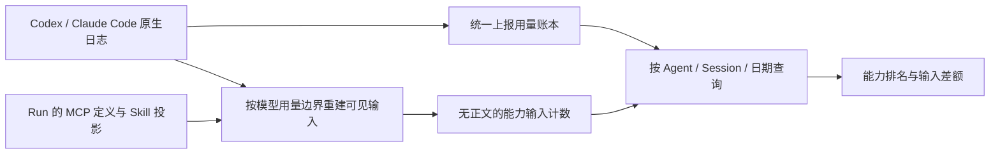

# 会话记录驱动的累计能力占用

## 目标与选择

默认配置下就能比较 MCP Tool、CLI、Skill、插件、提示词和对话内容在多次模型请求中的累计输入占用，并按 Agent、Session 和日期筛选。统计用于发现优化机会；可复算的估算已经有价值，不把逐字还原服务端请求作为启用功能的前提。

| 方案 | 用途 | 本次选择 |
| --- | --- | --- |
| 原生会话日志 + 运行时能力配置 | 无需更换 OAuth/API-key 路由，可补算保留的会话 | 默认路径 |
| HTTP 请求转发采集 | 直接观察请求正文和工具定义 | 保留为显式启用的增强路径 |
| 按总输入比例分摊能力 | 没有具体内容依据，容易掩盖归因误差 | 不采用 |
| 修改各 Provider 核心或强制启用专有遥测 | 增加版本耦合和接入成本 | 不作为前提 |

复用现有来源协调器、统一用量账本、模型词表、能力排名、查询 Worker 和管理页。新增模块仅负责会话上下文重建，以及运行时配置到通用能力身份的映射。

## 数据流与口径

三种数值保持独立：

1. **模型上报用量**：Provider 的原生 usage。Agent、Session、日期均查询同一账本，累计值与明细对账，缓存是输入的子集。
2. **一次性内容估算**：运行过程中出现的提示词、参数、工具结果、回复等内容量。
3. **累计输入估算**：在每个模型请求边界累计当时可见的上下文。内容留在后续上下文时，每次重新计入；本次模型刚生成的输出不能计入本次输入。

例如，一个 100 token 的工具结果随后进入三个模型请求，首次结果为 100，重复结果为 200，累计结果输入为 300。跨日期筛选只改变选中的请求，不能把昨日的首次使用重新标成今日首次。

## 重建规则

- Codex 由增长的 `total_token_usage` 建立边界，忽略重复的限流/usage 通知。`last_token_usage` 与累计增量吻合时，将增量定位到完成时间，包括第一条及跨午夜请求。边界使用本地稳定身份，不冒充 Provider 请求 ID。
- Codex `response_item` 提供消息、参数、结果、可见思考。支持完整工具名，也支持拆开的 `namespace` 和 `name`。`tool_search_output` 中动态加载的定义在后续输入中累计；使用动态工具搜索时不再额外添加全部 MCP 配置定义。
- Claude 用 `message.id` 合并同一次请求的多条日志和 usage 修订，不重复计量；新请求先纳入上一请求的输出。
- 工具结果有时比调用它的模型 usage 更早落盘。先暂存当前响应及其快速结果，完成当前输入快照后再纳入历史。
- Codex `compacted.replacement_history` 和 Claude 压缩边界替换上下文。被压缩移除的工具内容不继续累计。
- 没有动态定义记录时，以该 Run 冻结的已允许 MCP 工具配置估算定义占用。旧历史没有配置快照时仍分析消息和工具结果，不用当前配置伪造过去的定义。
- 明确读入 Skill 路径、运行其脚本或调用已投影的 `Skill`，会附加 Skill／插件标签；未识别内容仍保留为通用工具或提示词维度。
- 原生插件实际投影的 Skills 与托管 Skills 共用 Run 归属映射，Runtime Handle 复用时保留；Claude 独立注入的 Skill 指令按 `sourceToolUseID` 关联调用，正文进入技能及插件的累计占用。
- 系统指令、用户提示词、配置指令、模型回复、可见思考分别计量；已包含在日志中的配置指令不额外添加。

## 与总量的差异

重建统一标为“会话重建估算”。词表计数仍是内容估算，不等同于 Provider 账单。

页面对比同一批已分析请求的上报输入与去重后的输入估算，显示有符号差额。输出 token 不参与输入对比。一个内容块附有工具、Skill、插件多个标签时，在这张对照卡里只算一次，各维度排名仍保留对应贡献。

未记录的系统内容、协议封装、媒体、服务端上下文变化和分词误差都可能进入差额；估算偏大时允许显示负差额。不把差额按比例硬分给工具，也不把已知估算全部隐藏。

## 存储与性能

- 原生日志增量读取；每段新内容计数后只保留数值、来源和能力身份，数据库不复制消息或工具正文。MCP 定义在同一配置／模型内复用计数，配置快照只在内容变化时写入。
- Run 时间定位使用 Session／开始时间索引；Skill 投影在单次采集的当前 Run 内复用，切换 Run 或重新采集时刷新，不逐调用重复读取和解析。
- 历史按能力、内容类型、分词来源及首次／重复分组，每个请求保存分组计数，避免每次复制所有历史消息导致平方增长。
- 词表及大文本计数复用现有 Worker。已知词表下载待完成时保留采集进度并重试；未知模型继续使用已标注的多语言兜底。
- 来源采集按记录数及时间提交 checkpoint；纯消息进度也能提交，避免长会话在超时后从头重算。
- 查询继续使用只读 Worker、有界缓存和分页。升级不提升原始事件回填版本，不触发另一轮事件表全量重放。

## 升级与保留

无需清库。原生日志解析 checkpoint 升级一次，后台对保留的来源重新分析；之后只处理新增部分，使用稳定身份覆写同一请求。已有 Provider 上报用量不重复相加。已清理的原始日志及缺失的历史能力定义无法恢复，其余内容继续可用。

显式配置 HTTP 采集的 Provider 由请求路径负责能力输入，日志只补用量，避免同一运行采用两套归因。Session 删除同时删除能力配置快照；存储清理和重置仍先执行现有采集屏障。

## 验收

- 同一 MCP 结果跨多个请求累计；参数和当次输出不提前计入输入。
- 原生命名空间、动态工具加载、响应修订、重复 usage 和压缩边界正确。
- Agent、Session、日期查询与同一原生 usage 对齐；首次请求及午夜增量不丢失。
- 配置指令不重复；Skill／插件标签不放大输入对照总额。
- Skill 的独立指令注入、采集中断恢复和原生插件在多个 Run 中的投影，均能通过真实来源协调器和 API 得到累计排名。
- 重启、重复采集和稀疏日志超时可续采，不增加原有累计值。
- API 返回累计排名与对照数据；前端展示估算来源、独立上报总量与差额。
- 用真实 Provider 会话日志复验上述核心链路。认证失败不能当作 Provider 验收成功。
