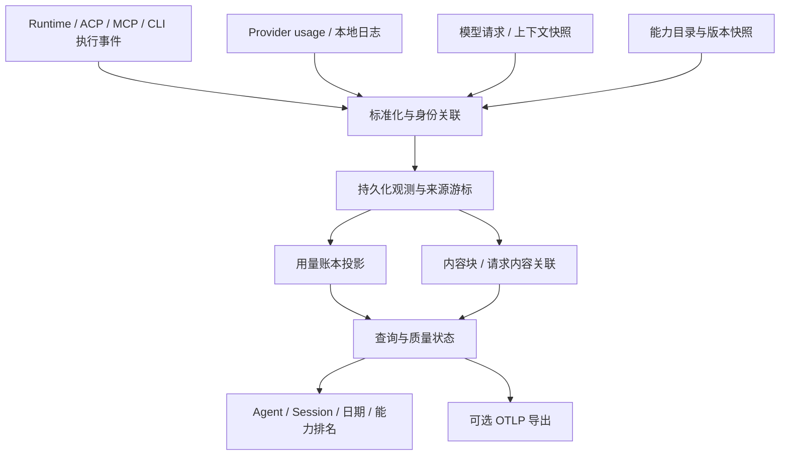

# Agent 用量与能力归因：实施设计

状态：原始需求审查后的修复、独立复审与离线验收已完成，未部署或完成真实 Provider／账单验收。[修复计划](../plans/2026-09-21-agent-usage-review-fixes.md)落实自动 HTTP/SSE 采集、恢复、日期归属、分类与输入证据下钻；支持范围和实际验证见[验收报告](../validation/2026-09-21-agent-usage-observability.md)。

本文定义目标行为，完成情况以[实施台账](../plans/2026-09-21-agent-usage-observability-progress.md)中的验证记录为准。配套任务见 [实施计划](../plans/2026-09-21-agent-usage-observability.md)。

**目标：从某个 Agent 某天的高消耗，追到具体会话、具体 MCP Tool / Skill / 插件 / CLI，以及实际进入模型的内容，区分已报告用量、估算贡献和缺失数据。**

## 1. 范围与产品边界

- 通用核心不依赖 Claude Code 原生遥测，不绑定任何一个 Agent、Provider 或模型 API。
- 首个宿主是 remote-agent-server；以后可抽取为库、CLI 和独立本地应用。
- 同时支持 Agent、Session、日期筛选，支持 Run、模型请求、工具调用下钻。
- 记录实际调用和内容来源；统计具体 MCP Server 下的 Tool，不能只按工具显示名合并。
- 开源能力按模块、算法、协议和测试样例采用，不以引入完整平台为前提。
- 第一个可验收版本必须包含一条工具归因闭环；仅有总量图表属于中间里程碑。
- 闭环必须包含真实 Runtime 配置到模型 HTTP 请求的自动采集路径；只导入人工生成快照不满足该条件。采集显式 opt-in，首批支持 API-key 上游，日志／执行观察仍可独立使用。
- 首版不做自动修改 Agent 配置、自动压缩内容、自动关闭工具或自动优化提示词。
- 首版保持单进程 SQLite，不引入消息队列、分布式协调、独立追踪服务或强制流量代理。

用户路径：选择日期和 Agent → 看到用量及缺失范围 → 打开工具排名 → 定位调用 → 查看模型实际读取内容与重复读取 → 查看有证据的优化建议。

## 2. 已确认的当前实现边界

以下为源码事实，不是已验证的生产损失规模。

| 位置 | 当前行为 | 对设计的影响 |
| --- | --- | --- |
| `src/runtime/acpx-runtime.ts` 的 `aggregateSessionUsage` | 有 `perRequest` 就求和，否则使用 `cumulative` | 当前汇总依赖上游缓存的粒度、语义和保留范围 |
| 安装的 `acpx/dist/runtime.d.ts` | `perRequest` 明确按用户消息 ID 索引 | 它不是模型 HTTP 请求列表，也不能直接用业务 Run ID 查询 |
| 安装的 `acpx/dist/live-checkpoint-*.js` | `applyTokenUsage` 覆盖 `cumulative_token_usage` 和当前用户消息用量；最多保留 100 条 request 用量 | `cumulative` 名称不能证明可差分；最近 100 条不能当完整历史 |
| `src/runs/run-executor.ts` | usage 更新先合并到内存，终态保存 Run；最终 Session 用量依赖 status 查询 | 持久化要覆盖中途失败、进程退出和最终状态查询失败 |
| `src/runs/run-repository.ts` | Agent / Session 汇总直接读取 Session 上的最新计数 | 需要可追溯的独立账本作为新统计来源 |
| `src/sessions/session-maintenance.ts` | Reset 清空 Session token 字段；cleanup 保留；delete 删除业务记录 | Reset、清理正文、显式删除必须有不同语义 |
| `src/mcp/run-mcp-preparer.ts` | 仅设置 `allowedTools` 时启用现有转发包装 | 不能只观测现有包装路径并宣称覆盖全部 MCP |
| `src/runtime/acpx-runtime.ts` 的 `toolContent` | 保留 toolCallId、状态、原始输入输出等；没有统一 MCP 身份模型 | 需要独立能力目录和名称映射，显示标题不能当身份 |
| `src/runtime/skill-projector.ts` | 已计算投影 revision | 可登记能力版本，但投影不证明模型读取或使用 Skill |

现有测试 `test/runtime.test.ts` 中“完整 perRequest / 精确用量”的假设需要在实现阶段用来源粒度测试替换；不能只把 100 改成更大的数。

## 3. 总体架构与依赖方向



建议目录边界：

```text
src/agent-usage/
  core/       事件类型、归一化规则、对账、内容归因
  adapters/   acpx、日志、MCP、模型上下文等来源
  storage/    SQLite 存储、模块迁移、正文存储接口
  query/      筛选、时间分组、排名、详情
  source-coordinator.ts  来源登记、采集调度、生命周期屏障
```

宿主接线保留在现有 Runtime、RunExecutor、SessionMaintenance、MCP preparation 和路由层。核心层不导入 Fastify、React、业务 Manager 或宿主的 `Provider` 枚举；SQLite 实现放在 storage 层。不要先把整个仓库改成 monorepo。

宿主提供稳定的 `namespace` 和不透明字符串 ID，负责把数字 Agent / Session / Run ID 映射为字符串。独立应用从自己的来源登记这些 ID。核心模块拥有自己的表与迁移版本，不占用宿主 SQLite `user_version`。

## 4. 先定义统计口径

### 4.1 五种不同的数

| 数值 | 含义 | 是否能作为模型账本 |
| --- | --- | --- |
| Provider 报告 token | 某一明确范围内的输入、输出、缓存等 | 语义与范围已确认时可以 |
| 上下文占用 | 当前上下文使用量 / 窗口大小 | 不可以累加为历史消耗 |
| 原始工具输出大小 | 工具返回的字节、字符、可选分词估算 | 只说明产出量 |
| 模型可见内容 token | 最终输入中可检查内容的本地分词 | 属于解释性估算 |
| 费用 | Provider 报告金额或按价格快照计算的金额 | 必须区分报告值、推算值和未知 |

不把这些指标混为一个 `tokens` 字段。默认模型用量来自选定账本；默认工具消耗排名使用已观测的累计输入贡献，并明确“估算”与覆盖范围。

### 4.2 归一化 token 字段

新模型使用 `inputTotalTokens`、`inputUncachedTokens`、`cacheReadTokens`、`cacheWriteTokens`、`outputTotalTokens`、`reasoningOutputTokens`、`totalTokens`，值为非负安全整数或 `null`。

- 适配器声明源 input 是否包含 cache read / write；归一化后的 inputTotal 包含已确认属于输入的缓存部分。
- reasoning 是否属于 output 必须由来源协议确认；不能重复加到 outputTotal。
- 仅在分项包含关系完整且经过验证时推导 total；否则保留原始 total 或 `null`。
- 各字段分别保存来源与派生规则。请求的 model 也有来源；Run 的计划模型不冒充逐请求实际模型。
- `contextUsedTokens`、`contextWindowTokens` 保存为上下文状态，永远不参与用量求和。
- 非文本内容、服务端封装和未知 tokenizer 的差异保留未解释状态，不统一叫作“隐藏上下文”。

### 4.3 费用

保存货币、计费量纲、模型、价格表版本、有效时间和服务档位；金额使用十进制字符串或定点数。已报告费用与估算费用分别返回，不能混加多个币种。

未知价格返回 `null`。订阅内模型的目录价估算不叫“实际账单”。只有总缓存用量、没有块级缓存证据时，不声称某个 Tool 的精确费用；首版以内容 token 排名为主。

工具内部的 LLM 请求能被采集时，作为独立模型调用关联工具调用。没有内部观察能力时只显示“内部模型用量未采集”。工具内容在外层模型中的输入贡献和内部调用账单分栏展示。

## 5. 身份、事件协议与适配器合同

### 5.1 身份关系

```text
namespace
  Agent 配置身份（agentId）
    业务 Session（sessionId）
      执行尝试 / Run（executionId）
        模型请求尝试（modelInvocationId）
        工具调用（toolInvocationId）
```

`runtimeKind` 表示 Claude Code / Codex / Hermes 等执行器，与 Agent 配置身份独立。`modelProvider` 表示模型服务来源。子 Agent 保存 `parentExecutionId` / `parentInvocationId`；它的原生会话 ID 和宿主业务会话 ID 分开保存。

业务 Session 可以有多个 `providerEpochId`。仅重连不创建新 epoch；确认 Provider Session 被替换、Reset 成功或计数周期确实改变时创建。无法解释的计数下降先标冲突，不能自动把负差值截成零。

### 5.2 标准事件信封

以下为设计合同示意，判别联合类型在实现时补齐。`eventId` 去重观测；`invocationId` 识别实际操作，两者用途不同。

```ts
type ObservationEnvelope = {
  schemaVersion: 1;
  eventId: string;
  sourceId: string;
  sourceVersion: string;
  sourcePosition: string | null;
  observedAt: string;
  occurredAt: string | null;
  namespace: string;
  agentId: string | null;
  sessionId: string | null;
  executionId: string | null;
  providerEpochId: string | null;
  invocationId: string | null;
  parentInvocationId: string | null;
  kind:
    | "invocation.started" | "invocation.finished"
    | "epoch.started" | "epoch.ended"
    | "usage.observed" | "context.observed"
    | "capability.snapshot" | "source.status";
  payload: unknown; // 实现时按 kind 使用严格的版本化结构
};

type UsageObservation = {
  scope: "model_request" | "turn" | "provider_session" | "unknown";
  semantics: "delta" | "cumulative" | "snapshot" | "unknown";
  coverageId: string | null;
  intervalStart: string | null;
  intervalEnd: string | null;
  finality: "interim" | "final" | "unknown";
  measurement: "reported" | "derived" | "estimated";
  metrics: Record<string, number | null>;
  normalizationProfile: string | null;
};
```

`snapshot` 表示同一范围的当前读数，更新替换该范围的旧版本；`delta` 才允许对独立、可去重事件求和。未知范围或语义的数据仍可保存和展示，但不得进入可累加总量。

usage payload 保留原字段名及必要的数值原文，不只保存已经归一化的结果。epoch 生命周期同样持久化为事件，恢复时重建宿主关联。乱序更新按来源序列 / 明确修订处理，较晚到达的 interim 不能覆盖 final；显式更正保留前后版本和原因。Run 已终结后收到有效 usage 仍可补充账本，不改写业务执行结果；主体已显式删除或来源映射已撤销时拒绝补报，见第 8 节。

工具和模型的 started / finished 是同一 invocation 的状态推进，不增加调用次数。流式分片、进度通知、同一结果的重放也不是新调用。可识别的模型重试分配独立 attempt；只有 SDK 逻辑调用时不能推测隐藏重试次数。

### 5.3 适配器最小接口

```ts
interface UsageSourceAdapter {
  describe(): SourceCapabilities;
  collect(input: SourceInput, checkpoint: string | null): AsyncIterable<ObservationEnvelope>;
}
```

`SourceCapabilities` 至少声明运行环境、可观察粒度、usage 语义验证状态、上下文可见性（full / partial / opaque / none）、稳定身份能力和内部子调用覆盖。不要只返回一个笼统的 `supported: true`。

`SourceInput` 是按来源类型区分的合同：宿主事件使用已登记的流身份；Codex / Claude 日志使用宿主解析后的文件句柄、文件代际和停止位置；上下文快照使用文件句柄、快照摘要和格式版本。适配器不自行扫描任意目录，也不从输入中接受认证凭据。注册与显式映射见第 6.4 节。

内嵌模式可以直接 `ingest(event, binding)`；日志导入使用 collect。`binding` 由协调器签发，包含 subject / mapping 的 ID 与 generation；不是相信事件自报的 Session ID。游标只有在对应事件事务提交后才能推进。文件轮转 / 截断通过文件代际识别，不能仅用偏移。解析器版本保存在事件中，升级允许重新处理旧观测，但仍须通过当前主体与映射的存活检查；正文已清理时明确不可重算的部分。

协调器拥有 `registerSource`、`collect`、`prepareMaintenance`、`revokeSubject` 四个入口，依赖模块存储和已登记适配器；宿主负责认证、业务身份校验和文件授权。采集任务与异步分析在提交事务内重新校验 binding generation，失效任务不得推进相关业务投影。全局来源读取游标可以前进，但撤销范围的记录按拒收处理，不能改投到未归属桶。

## 6. 来源组合与关联策略

### 6.1 第一轮来源能力矩阵

| 来源 | 当前可确认用途 | 不能直接承诺的能力 | 实施验证 |
| --- | --- | --- | --- |
| acpx Runtime | Run 生命周期、工具事件、usage 观测、Session 身份 | 逐模型请求完整 usage / 全量上下文 | 针对各 Runtime 的协议样例确认 scope 与 semantics |
| Codex 本地记录适配器 | 借鉴已有解析逻辑和 replay 处理 | 每个版本都提供最终线上的完整请求 | 仅对明确给定的文件与版本解析，缺失字段保留未知 |
| Claude Code 本地记录适配器 | 借鉴消息与 usage 关联；不启用原生遥测 | 将本地消息记录视为最终 API payload | 独立样例验证多次模型调用、子 Agent、截断 |
| Hermes 本地状态适配器 | 会话汇总导入候选 | 把会话聚合分解成请求或精确日期 | 保留原有粒度；请求级来源另行验证 |
| MCP 转发观察器 | server / tool 身份、真实调用、原始结果与状态 | 最终模型可见结果、工具内部 LLM | 配合上下文源或内部 SDK 插桩 |
| SDK / 请求构建处观察器 | 可控制进程的模型请求、usage、调用链 | 自动进入第三方 CLI 内部 | 只承诺已接入的进程 |
| 可选网络代理 | 受支持协议的请求、流式响应与 usage | 被绕过的流量、加密状态、私有服务端步骤 | 支持声明 + 断流 / 多路请求样例 |

“通用”指统一合同加适配器，不承诺一个拦截点覆盖所有 Agent。第一版以宿主事件和 MCP 观察器作为执行事实，选取有证据的日志 / 请求来源补 usage 与上下文；缺少上下文的 Runtime 只能交付对应的调用统计。

首批实现顺序为：acpx 宿主事件 → Codex 本地用量来源 → Claude Code 本地记录来源 → 自动 HTTP/SSE 模型请求采集。上下文层定义 canonical invocation 导入／观察接口，自动捕获和手动“上下文快照（Context Snapshot）”共用规范化逻辑。网络转发与业务表分离，只覆盖显式配置且验证过的 Runtime／协议，不强制所有用户切换路由。

手动适配消费用户明确选择的 `context-snapshot-v1` JSON 文件。这是本项目定义的输入合同，包含 canonical request / response、Provider usage 和上下文完整度；任何采集器都可按合同生成文件。自动 HTTP/SSE 采集直接把内存中的规范化请求交给同一归因逻辑，无需写出快照。系统没有集成第三方代理，也不把该格式称作第三方原生导出。归因由本项目从源证据重算，不接受外部工具汇总作为计数事实。

快照的来源 Session 不能自动当作宿主业务 Session，必须有明确映射或共同请求身份，否则保留未归属。重复导入更新后的完整快照需处理记录修订和迟到终态，不能仅按首次时间游标跳过旧记录；生产方更新文件时递增 `revision`。模型输入里的工具记录只增加独立上下文证据，不增加实际执行次数。上下文快照是可选来源，自动转发入口由宿主在请求接纳时冻结绑定。

### 6.2 去重与对账

按以下次序关联：Provider 请求 ID 及其来源命名空间 → 明确传递的 invocation / trace / tool-call ID → 已知宿主映射。内容哈希、时间邻近和 token 数只能辅助匹配，不能单独合并两次真实请求。

- 同一来源的重复事件由 `(namespace, sourceId, eventId)` 去重。
- 多来源观察同一操作时保留全部观测，投影选择一个计数主体，其他是证据。
- 同一 MCP 调用的客户端和服务端 span 不算两次工具调用。
- wrapper 与 Runtime 不能稳定关联时，MCP 调用排名以已登记的 wrapper 为该 Server 的计数来源；Runtime 观测保持未关联，不再作为第二份该 Server 调用累加。
- 原始输入结果匹配失败时保留未归因。相同内容来自两个工具时，不仅凭哈希任选一个。
- fork / resume 继承的历史记录不是新生成用量；后来模型实际再次读取这些历史内容是新的输入使用，两者分别处理。

每个可对账范围选择一个会计基础，不能把父范围汇总和子范围明细相加：

1. 有完整、无重叠且语义已验证的请求记录：用请求记录合计。
2. 只有经过验证的 turn / session 聚合：按该范围保存一个汇总，展示粒度限制。
3. 明细不完整但有可信范围总量：总量视图采用范围总量，排名和时间趋势仅展示可定位明细；差额显示“未定位”，不平均分配。
4. 来源冲突或包含关系不明：保留双方及冲突状态，不使用“取最大值”作为修复。

只有确定 epoch、累计语义和基线时才能差分。首次看到非零累计值可以作为该 epoch 的历史范围汇总，不能记为当前请求。中断期间的增长只有区间信息时保留区间，不虚构具体日期。

### 6.3 MCP 进程复用

启用观察时，允许过滤列表为“全部”的透明包装路径。保持现有权限校验、取消、上游能力、通知转发、超时和完整进程树清理；观察失败不吞掉或伪造工具结果。

观察进程使用独立本地通道，stdout 继续只承载 MCP 协议。首个宿主可采用权限受限的 Unix socket，由宿主进程统一写 SQLite；不让每个 MCP 子进程独立写业务库。

包装进程登记稳定的 Session、Server、进程实例和 Provider epoch，不把首个 Run ID 固定在启动环境中。每次调用开始时冻结其归属，调用结束后仍使用该归属。

优先使用请求中明确传递的执行身份。缺少传播时，基于当前 Session 执行窗口的关联必须标记推断；不能保证归属的后台、跨窗口或迟到调用保持未归属。不能把收到完成事件时恰好运行的新 Run 当作调用拥有者。

### 6.4 首版来源登记与采集入口

首版提供管理 API，不等待 T7 的独立 CLI。`src/app.ts` 注册来源协调器和管理路由，复用现有管理认证、配置持久化与关闭流程。宿主事件自动登记；本地日志与上下文快照通过以下入口显式配置：

| 路由 | 请求与结果合同 |
| --- | --- |
| `POST /api/usage/sources` | `sourceKey`、`kind=codex_log\|claude_log\|context_snapshot`、`inputRef`、`mappings[]`；创建返回 201，相同 sourceKey 与配置重试返回已有来源，配置不同返回 409 |
| `POST /api/usage/sources/:id/collect` | 启动一次有界采集，返回 202 与 `collectionId`；同来源已有活动任务时返回原任务，不再并行启动 |
| `GET /api/usage/sources` | 返回来源 ID、能力、映射状态、collectionId、采集 / 分析进度、已提交 checkpoint、最后成功时间及脱敏错误 |

`inputRef` 只接受二选一：宿主管理的 `providerSessionRef + relativePath`，或运维配置的 `importRootId + relativePath`。首版不接受远端 URL、任意绝对路径或上传正文；导入根目录默认未配置。宿主校验目录权限、真实路径与符号链接边界，采集时再检查文件身份，限制单文件大小、批大小与执行时间。Provider Session 引用必须属于映射的业务 Session；导入根目录由部署配置显式授权。详情响应不泄露绝对私有路径或正文。

每项 mapping 明确 `sourceSessionKey → sessionId + providerEpochId`，Agent 由当前宿主 Session 确定，不能由调用方任意拼接；可选的执行映射必须核对 Run 所属 Session。混合多个 epoch 的源需要逐记录可证明的映射，否则拒绝绑定该范围并保留未归属。不存在 / 已删除的主体不能创建映射；已撤销的 sourceSessionKey 不能重新绑定或退回未归属导入。首版不提供自动重新归属旧记录的接口。

手动来源注册后由 collect 显式启动；宿主管理日志在 Run 收尾、启动恢复和关闭后采集，并在维护前进入第 8.1 节屏障。未登记来源的日志同样需要恢复；有界批次需有归属明确、可停止的后续处理，不能把剩余队列留到下次重启。失败持久保留且可查询。快照每次 collect 检查全部记录身份和修订摘要，而非只取首次时间之后的记录。更新快照使用同一来源 ID；源身份变化必须重新登记。注册尚未 collect 时显示“待采集”，不能显示已覆盖。

自动入口通过 `USAGE_CAPTURE_UPSTREAMS` 指定协议、固定上游与 API-key 环境变量名。Provider 使用本地临时凭据，转发层注入指定上游认证，不复用未知 OAuth 凭据；正文有界处理后只持久化派生数据。冻结每次请求的 Session generation、epoch、Run，维护和关闭先排空请求；迟到、失败、超限、未知协议与没有观察到流量分别呈现。完整合同与受控 Runtime 启动验收见修复计划 Task 2。

协调器在 SQLite 中持久化活动采集的 checkpoint / 状态；重启恢复已接纳但未完成的任务，失败任务保留原因并支持同入口重试，不重置已提交游标。关闭时有界停止读取并提交已处理批次，剩余部分由重放恢复；不依赖内存队列充当持久存储。该调度仅管理单进程内的采集工作，不新增外部任务队列。

## 7. SQLite 存储与恢复

五类逻辑数据是能力、调用、用量观测、内容块和请求内容关联。物理上再保存来源游标与可重建账本投影，建议表如下；分阶段增加，不一次搭建通用事件平台。

| 表 | 核心键与职责 |
| --- | --- |
| `agent_usage_sources` | sourceId、namespace、sourceKey、授权输入引用、适配器版本、能力声明、游标、活动采集状态、覆盖区间、健康状态 |
| `agent_usage_subjects` | namespace + subjectKind + subjectId、generation、active / draining / deleted；维护意图、各来源冻结边界与完成状态；删除后只留最小拒收标记 |
| `agent_usage_source_mappings` | sourceId + sourceSessionKey、目标主体 / epoch、generation、active / revoked；撤销记录防止旧来源恢复绑定 |
| `agent_usage_events` | 不可变 eventId、来源、维度、事件类型、版本化最小 payload；不嵌入原始大正文 |
| `agent_usage_invocations` | invocationId、kind、父调用、Agent / Session / execution / epoch、开始结束、状态、模型、身份质量 |
| `agent_usage_ledger` | 选定的范围或请求用量、coverageId、会计基础、来源证据、时间粒度、归一化指标、冲突状态；可重建 |
| `agent_usage_capabilities` | capabilityId、revision、类型、来源稳定 ID、显示名、别名、插件归属和映射版本 |
| `agent_usage_content_blocks` | blockId、内容身份、角色、来源调用、能力引用、原始 / 可见 / 摘要状态、正文引用与保留状态 |
| `agent_usage_context_exposures` | 模型调用、上下文修订、blockId、出现位置、估算 token、tokenizer 版本、来源证据 |

关键约束：

- 事件唯一约束在来源范围内；同一事件重放不会再次更新总量。
- ledger 的请求行和范围汇总有不同类型，对账投影控制选择；禁止对全表无条件 `SUM`。
- content hash 不作为 invocation 身份；同一块在一次请求出现两次要有两个 occurrence。
- exposure 使用 `(modelInvocationId, contextRevision, position)` 唯一约束；新的上下文解析修订替代旧修订参与查询，不能双计。
- 按 namespace + 时间、Agent + 时间、Session + 时间、capability + revision 建必要索引；初版查询明细，不先做全量日表。
- 用量小事件提交、对应投影更新和游标推进在同一事务内；正文分析异步推进，查询返回分析进度。
- ingest / 分析提交与删除使用同一事务边界检查主体状态和映射 generation；删除后的迟到任务不能重建投影。Reset / cleanup 的屏障需另外等待待删来源对应的正文派生统计提交。
- 使用现有 SQLite WAL 连接和单进程写入模式。模块迁移表和前缀独立，内部可使用外键，不依赖宿主业务表外键。
- 数据库不可写时不能声称已经保存；采集状态进入 degraded，记录可恢复来源 / 丢失窗口，恢复后从已提交游标重放。既不无限缓冲，也不为了统计无限阻塞任务终态。

原始用量观测和最小溯源元数据持久化。首版不持久化完整请求、工具参数和结果，在内存中完成提取、分词和匹配后保存统计与来源；没有诊断正文保留开关。后续若增加正文存储，需另行实现宿主加密、容量与期限限制，且不导出凭据或认证头。未保留正文时详情明确说明，不能显示空文本并暗示工具没有输出。

## 8. 生命周期与历史迁移

| 场景 | 账本行为 |
| --- | --- |
| 成功 / 失败 / 取消 / 超时 | 保存已收到的用量和观测；缺少最终 usage 标明不完整 |
| 进程重启 | 重放未完成来源；未收到终态的 invocation 标记 interrupted / unresolved，而非伪造零用量 |
| Provider 重连 / idle eviction | 保留 epoch 和历史；重新建立采集关联，不默认重置计数 |
| Reset 成功 | 先完成删除来源前的采集屏障，再结束旧 epoch，保留全部历史；新上下文新 epoch |
| Reset 失败 | 保留旧账本；无法判断 Provider 状态时标记待核对，不提前提交新 epoch |
| Session 存储 cleanup | 先完成采集屏障，再清理来源 / 大正文；保留账本、排名所需计数与元数据，禁止恢复执行的既有约束不变 |
| 显式删除 Session / Agent | 撤销主体与来源映射并删除相应观测、明细和正文；保留最小拒收标记，阻止迟到事件或重放复活。日后匿名统计保留另行设计 |

### 8.1 Reset / cleanup 的持久采集屏障

Run 终结不代表来源日志已读完。屏障必须位于第一次销毁来源之前：包括 `acpx-runtime.resetSession` / `forgetSession` 中的 `close({ discardPersistentState: true })`，以及 `completeSessionMaintenance` 的 `providerSessionCleaner.purge` 和 Workspace 清理；仅在 cleaner 前 flush 不够。

1. 利用宿主现有维护 claim 阻止新 Run，确认该 Session 无活动执行；事务保存 `maintenanceId`、意图和 draining 状态。
2. 停止该 Session 的生产者但保留其持久来源。必要时拆开“停止进程”和“丢弃状态”，不能调用会先删除日志的 close。冻结有限的源代际 / 文件结束位置及已接纳事件序号；不等待不可证明一定会出现的 Provider final。
3. 协调器读到冻结边界，将 usage 观测、游标及待删来源的排名 / exposure 派生数据持久化，再标记屏障 ready。默认不复制完整正文到旁路存储；分析未完成则保留原来源文件。
4. 只有 ready 才允许 discard / purge。之后事务提交宿主维护结果与 epoch 变更；来源已经缺少最终 usage 的情况仍标不完整，屏障通过不等于覆盖完整。

每次尝试有超时和有限批次；超时、解析失败或数据库不可写时返回稳定的 `usage_collection_pending`，保留维护意图和来源，阻止新执行与破坏性清理。恢复任务按已有维护恢复机制重试，不占用一个无限等待的 HTTP 请求；失败原因与待处理范围可查询。已经丢失的来源记录缺口，不伪造成功；用户若选择显式删除则走第 8.2 节。

崩溃后凭 maintenanceId 和冻结边界幂等续做：ready 前继续采集，ready 后允许重复 purge，已完成的 epoch 提交不得再执行。旧 epoch 在屏障 / 维护失败时不提前切换；idle eviction 不删除来源时无需这种破坏性维护屏障。

### 8.2 删除后的拒收与防重导入

显式删除意图与保留统计的维护不同，不必先收集即将删除的数据。宿主与模块共用事务：先递增主体 / 映射 generation 并标记 deleted / revoked，取消该范围的采集与分析，再删除相应事件、投影、关联及无引用内容；Agent 删除覆盖其 Session 与 Agent 自身范围。写入事务内的状态校验负责拦截已在途、尚未提交的任务，不能只依赖内存取消。

最小拒收标记只保留 namespace、不可复用主体 ID、generation 和撤销来源键，不保留名称、正文、用量或统计。登记、ingest、补报、投影重建和重启重放均检查该边界；稳定返回 `usage_subject_deleted` / `usage_mapping_revoked`，不自动创建不存在的宿主 Session，也不把被删除范围的数据改存为未归属。共享来源的其他 Session 继续采集。

首版禁止对已删除主体或已撤销来源键重新导入；恢复导入作为后续明确功能设计。外部正文删除使用持久清理标记，失败可重试，只有其他未删除主体仍引用的共享内容可保留；删除后的查询立即不可访问已删主体的正文。

### 8.3 历史导入与兼容切换

历史升级采用一次性、可重入导入，不扫描任意 Provider home：

1. 旧 Session 总量导入为 `legacy_session_snapshot`，明确语义未完全核实、时间不可细分。
2. 旧 Run usage 与 Session 汇总可能重叠，不能直接相加；Run 记录先作为对账证据。
3. 有授权来源日志且确认时间、身份和包含关系时，用更细粒度证据替代对应范围的投影。
4. 实现初期并行比较旧显示值和新投影，不静默覆盖历史；上线文档说明新旧口径切换。
5. 原有 API 字段在实现阶段制定明确映射并测试。新分析 API 保留丰富的质量信息，不能把未知范围硬塞成“精确用量”。

同一次 Reset 的 epoch 变更与宿主状态提交应事务化；历史导入也必须通过第 8.2 节拒收边界，不能因重建或升级重新创建已删除数据。

## 9. 能力与内容归因

### 9.1 能力身份

| 类型 | 身份与证据 |
| --- | --- |
| MCP Tool | namespace + 稳定 Server 配置 ID + 原始工具名；revision 保存定义摘要 / 配置版本，显示名是别名 |
| 内置 Tool | runtimeKind + 原始工具名 + 可用的版本；显示标题仅作展示 |
| CLI | 可确认的 executable 身份和独立进程调用；复杂脚本只有外层边界时按组合操作记录 |
| Skill | 来源 ID + 插件 / 包身份 + Skill 路径；投影 revision、真实路径和别名用于匹配 |
| 插件 | 来源与稳定插件 ID；通过版本快照关联它提供的 Skill / MCP / Hook |
| Hook | 只有独立执行证据时记录调用；配置存在不等于执行 |

记录能力目录的投影 / 发现事实，不把目录中的全部工具定义直接计算为模型输入。只有最终模型请求包含某个定义，才记录 definition exposure。

### 9.2 同一内容的多个视角

内容可同时具有生产工具、语义来源 Skill、所属插件、宿主 Run 等标签。例如 CLI 读取 Skill 文件，既是一次 CLI 调用，也是 Skill 正文被读取的证据。

- MCP、Skill、插件、CLI 排名是不同视角，不把各页合计再加成全局总量。
- 同一插件通过多个关系命中同一 exposure 时，先按 exposure ID 去重再求和。
- 需要可相加的内容分类图时，对每个 occurrence 选择唯一主分类，其余是标签。
- 明确的执行父子关系可以形成包含子调用的成本视图；仅因之前读取 Skill，不把后续所有推理归给 Skill。

Skill 阶段分别记录 `catalog_visible`、`body_read`、`reference_read`、`script_executed`。配置投影只能证明 available；统计“使用次数”必须显示采用的阶段定义。

### 9.3 内容与重复读取

保留原始产出和模型可见版本的区别。截断、清洗、摘要形成新块，附来源关联；无法建立映射时标未知。

对于选定范围内的一个工具，累计输入贡献包括实际输入中的定义、历史调用参数和结果；每次出现均计一次。模型本轮生成调用参数的 output token 另列，不能重复计入当前 input。

```text
累计输入贡献 = Σ 每次请求中归属该能力的可见内容估算 token
结果首次输入 = 每个结果第一次被模型读取的可见 token
结果重复输入 = 后续读取同一结果或其可确认版本的可见 token
```

“首次 / 重复”以已知完整调用历史为依据。如果采集开始前可能已经出现，标记 `firstSeenBeforeCaptureUnknown`，不能把首次观测自动认定为第一次输入。选择日期范围不重置第一次读取的位置。

内容被缓存仍然计入输入贡献，但费用处理不同。上下文压缩后统计压缩块，不沿用旧全文 token。加密 / 不可检查状态仅保留可见项及 opaque 标记。图像、音频等没有可靠 tokenizer 时保留模态和大小，不用字符算法伪造 token。

分块分词之和可能与整段分词不同；封装开销保留独立分类。Provider 输入总量与本地可见内容之差允许有符号，不强制归零或按比例摊给工具。

## 10. 时间、排名与查询 API

### 10.1 时间与聚合

时间保存 UTC，查询接受 IANA 时区；日期区间采用 `[from, to)`。默认页面为最近 7 个日历日、浏览器时区，URL 保留筛选与时区。

模型用量按来源记录时间归属，首版返回 `timeBasis=source_timestamp`，不把日志时间一律声称为线上请求开始时间。只有跨日区间或无时间的历史汇总归入 `unplacedUsage`，不塞入导入当天。工具调用次数按调用开始时间，输入贡献按模型请求记录时间；跨日后两项自然可能不同。

Agent / Session / 日期组合筛选使用同一投影。首版仅提供 `subagents=self`，范围是明确映射的业务 Agent／Session，不自动扫描或推断 Provider 内部子 Agent 树。含后代模式待来源提供可靠父子身份和不重叠请求证据后再开放，不能让 include 参数看似有效却仍只返回自身。

会话页同时展示全部生命周期和当前日期范围，名称明确。日期分组处理夏令时，不使用固定 24 小时推算所有本地日界线。

### 10.2 管理 API 草案

以下均置于现有管理认证内，不向公开 Integration SSE / Webhook 透传原始观察数据。核心查询不依赖 HTTP。

| 路由 | 用途 |
| --- | --- |
| `GET /api/usage/summary` | 选定范围总量、可定位明细、未定位汇总、质量状态 |
| `GET /api/usage/timeseries` | day / week / month 趋势及时间口径 |
| `GET /api/usage/capabilities` | 指定维度的能力排名 |
| `GET /api/usage/invocations` | 按 Session / 能力筛选调用，稳定游标分页 |
| `GET /api/usage/invocations/:id` | 调用、usage 来源、关联内容、后续请求中的出现情况 |
| `GET /api/usage/context-evidence` | 按能力与模型请求查询输入证据，覆盖标签、仅定义与未知内容，稳定游标分页 |
| `GET /api/usage/context-evidence/:id` | 无正文的暴露明细，保留原模型请求／工具调用关联 |
| `GET /api/usage/sources` | 适配器支持范围、采集进度、错误与缺口 |

来源登记与 collect 写入口见第 6.4 节，同样要求管理认证并使用路由 Zod 校验。首次接入操作文档必须包含“授权来源目录 → 登记与映射 → collect → 查询状态 → 查看排名”的可执行管理 API 示例；不能只提供 GET 路由或要求用户编写自定义导入程序。

共同筛选：`agentId`、`sessionId`、`from`、`to`、`timezone`、`runtimeKind`、`subagents`。排名额外接受 `dimension=mcp_tool|builtin_tool|cli|skill|plugin`、`sort` 和分页。维度不匹配、无效时区、超范围 limit 返回稳定验证错误。

响应包含 `asOf`、`analysisStatus`、`accountingBasis`、时间口径、缺失信息。总量字段分别表达已知值和缺失项，不把 `null` 序列化成零。

例如实施计划的会计样例，summary 的关键字段应表达为：

```json
{
  "accountingBasis": "model_requests",
  "usage": {
    "inputTotalTokens": 3000,
    "outputTotalTokens": 300,
    "cacheReadTokens": 1000,
    "totalTokens": 3300
  },
  "completeness": "partial",
  "observedModelRequests": 4,
  "requestsWithCompleteUsage": 3,
  "requestsWithMissingUsage": 1,
  "requestsWithPartialUsage": 0
}
```

这里的 totalTokens 是所选范围内的已知部分，界面必须同时显示 partial。Provider 总量与工具内容估算分开返回，不使用一张饼图暗示两者天然相等。

首版排名提供实际执行次数 `calls`、独立上下文证据数 `contextOnlyCalls`、执行成功／失败／未终结次数、原始结果大小、可见结果首次输入、重复输入、定义输入、参数输入、累计输入贡献，以及结果字节数和调用耗时 P50／P95。上下文证据不能冒充实际执行，两者不相加。缺少样本时保留样本数及未知，不用零代替分位数。重试次数和工具内部 LLM 用量需要额外来源证据，首版不提供这两项统计。

每行返回 identity / revision / measurement / attributionEvidence 和上下文覆盖。展示定义但没有调用的工具仍出现在定义消耗排名；只做调用排名时显示调用为零的语义。

## 11. 界面与验收体验

在现有 Agent、Session 页面提供“用量分析”入口，打开同一分析页并带好筛选。全局入口提供日期趋势与能力排名；选择一行进入调用详情，返回后保留筛选、排序与滚动状态。沿用现有组件和中英文文案机制。

分开呈现三类质量信息，绝不合成一个“准确率”：

1. 已观测模型请求中 usage 完整 / 部分 / 缺失的数量；完全看不到的请求不假装计入分母。
2. 已观测模型请求中上下文 full / partial / opaque / none 的数量及来源支持范围。
3. 已捕获可分词内容中直接关联 / 匹配 / 推断 / 未归因的 token。

状态文案至少覆盖：

| 状态 | 用户应看到的内容 |
| --- | --- |
| 尚未采集 | “尚无用量记录”，列出已接入来源及下一次 Run 将采集的范围；手动来源标“待采集”，链接到登记与 collect 操作文档 |
| 筛选无数据 | 保留筛选，提供清除筛选入口，不显示系统未配置 |
| 只有调用事件 | 显示次数与状态；token 列显示“未采集模型输入”，不显示 0 |
| 只有会话汇总 | 显示已知总量和粒度；日期趋势 / 工具归因说明为何不可细分 |
| 采集中 / 分析落后 | 显示最后更新时间和待分析数量，不能提前显示“完整” |
| 来源断开 / 格式变化 | 保留历史结果，显示缺口时间和受影响的指标 |
| 正文未保留 / 已清理 | 保留统计和溯源元数据，说明无法打开内容的原因 |
| 未归因 | 单独分组，可以打开相关来源，不能静默隐藏 |

首版优化建议使用重复读取、无调用定义暴露和失败调用的已有证据，提供关联工具及下钻入口。失败不等同于重试；大结果阈值和重复调用识别留待有可验证规则时增加。token 降低不能单独证明任务质量保持。

初版规则只出建议，不增加一次模型调用来解释每条记录。优化前后对比按相同任务样本和模型 / 能力版本进行，同时记录成功率与业务验收结果；不要把不同任务混合均值当作节省证明。

## 12. 开源采用清单

以下为设计参考与候选复用单元，不表示全部已接入。当前按用户后续授权采用 `@huggingface/tokenizers@0.2.0`，通过显式模型／Provider 注册表加载本地词表；早期 js-tiktoken 依赖已移除，历史计数保留原计量标记。复用现有 MCP SDK；其余引用用于格式与设计研究，没有复制源代码或形成运行时依赖。计量合同见[多模型实施计划](../plans/2026-09-21-model-tokenizers.md)，实际采用记录见 [PROVENANCE.md](../../../test/fixtures/agent-usage/PROVENANCE.md)。

| 来源 | 采用单元 | 方式 | 需要保留的边界 |
| --- | --- | --- | --- |
| [ccusage Codex loader](https://github.com/ccusage/ccusage/blob/main/rust/adapters/codex/src/loader.rs) | 日志格式、累计值与 replay 的处理案例 | 按需移植少量逻辑和测试场景 | 不复制无法证明身份的启发式合并；保留数据粒度 |
| [ccusage Hermes loader](https://github.com/ccusage/ccusage/blob/main/rust/adapters/hermes/src/loader.rs) | 本地状态读取结构 | 作为会话汇总适配参考 | 会话汇总不是请求明细 |
| [ccusage workspace](https://github.com/ccusage/ccusage/blob/main/rust/Cargo.toml) / [npm 入口](https://github.com/ccusage/ccusage/blob/main/apps/ccusage/package.json) | 多来源适配架构、CLI JSON 核对 | 固定版本 CLI 可作辅助验证 | 当前核心 Rust，不假定为可直接 import 的 TypeScript SDK；不是唯一真值 |
| [ContextSpy 请求归一化](https://github.com/RimantasZ/contextspy/blob/main/docs/transport-normalization.md) | 流式归并、调用边界、明确前驱 ID、partial / opaque | 移植相关状态机思路和回归场景 | 支持某传输不代表支持全部 Provider；不从时间顺序猜前驱 |
| [ContextSpy classifier](https://github.com/RimantasZ/contextspy/blob/11aa95827fd1a7970595cdfeb689b5c3ce1b0919/contextspy/analysis/classifier.py) | 内容分类和工具关联入口 | 按我们的口径重写 | 不采用未知结果平均分摊，也不要求存在 definition 才能记录 result |
| [OpenInference JS](https://arize-ai.github.io/openinference/js/) | 受控 SDK 插桩、OTLP 导出 | 有对应接入需求时使用现成库 | 不自动穿透第三方 CLI；导出规范与内部事件做版本化映射 |
| [FastMCP telemetry](https://gofastmcp.com/servers/telemetry) | MCP trace 传播和重复埋点处理 | 借鉴模式，复用当前 MCP SDK | 两侧 span 不是两次实际调用；内部 LLM 仍需观察 |
| [Hugging Face Tokenizers.js](https://github.com/huggingface/tokenizers.js) | 多模型分词引擎 | 直接依赖 0.2.0，使用本地固定词表 | 词表必须显式绑定实际模型；未知模型使用带标记的通用文本兜底，不回退 GPT；文本估算不等于账单 |
| [LiteLLM token usage](https://docs.litellm.ai/docs/completion/token_usage) / [Langfuse token tracking](https://langfuse.com/docs/observability/features/token-and-cost-tracking) | 模型路由与计量来源 | 借鉴设计，无框架依赖或源码复制 | reported 与 estimated 分离；不采用隐式默认词表或旧 Claude 词表 |
| [LiteLLM 价格目录](https://github.com/BerriAI/litellm/blob/main/model_prices_and_context_window.json) | 价格快照 | 仅采用需要的数据与字段 | 社区价格不等于用户账单，未知型号不套默认价 |
| [Langfuse 数据模型](https://langfuse.com/docs/observability/data-model) | 调用嵌套、Session 组织、追踪展示 | 参考并提供可选导出 | 不成为本地查询的必需服务 |

实际摘取代码时，为每个单元记录仓库、固定 commit、路径、许可证及保留声明、修改点和本地测试。当前已检查的 ContextSpy 文件带 Apache-2.0 声明；ccusage npm 清单声明 MIT。实施时仍核对被复制的具体文件及其依赖。新生产依赖按仓库规则单独确认，本设计不视为已授权安装全部候选。

## 13. 第一版验收与未决验证

第一版应完成三个连续里程碑：可信账本 → 具体工具与内容归因 → Agent / Session / 日期查询与用户下钻。独立 CLI 分发和外部平台导出后续交付，不阻塞核心闭环。

确定性用例必须覆盖：

- 超过 100 个历史分组仍可保存已采集完整历史；不能把有界上游状态当全量。
- 同一模型请求通过日志和运行事件被观察两次，只计一次；两个内容相同的真实请求仍计两次。
- acpx 用户消息分组不会伪装成模型请求；未知 usage 语义不会进入总量。
- 同范围多次 interim / final 更新、跨 epoch、字段缺失、累计下降和部分缓存字段。
- 最后 status 查询失败、取消、超时、崩溃恢复仍保留已提交用量。
- Reset、cleanup、显式删除行为分别符合本设计；历史导入可重入且不双计。
- Run 终结但日志尾部未读时立即 Reset / cleanup，屏障先提交尾部 usage 和必要归因；屏障超时保留来源，采集完成后崩溃再恢复不双计、不重复切 epoch。
- 删除与在途采集 / 分析并发、迟到 final、来源重放、历史重新导入都不能恢复已删主体；共享来源的其他 Session 及共享内容引用不受误删。
- 通过真实管理路由登记并映射合成上下文快照、触发 collect、查询具体 MCP Tool 排名；包含来源注册重试、采集中重启、修订快照、非法路径及已删除映射拒收。
- 两个 Server 同名 Tool 分开统计；wrapper 与 Runtime / OTel 两侧观察不双计。
- MCP 复用进程跨 Run、迟到完成与后台调用不会错误串到下一次执行。
- 工具输出截断后只计算模型可见部分；无 definition 的 result 仍可归因。
- 同一结果跨请求重复读取；同一请求两次出现；压缩、opaque、非文本与未归因。
- Skill 可用、读取和脚本执行分开；插件汇总对相同 exposure 去重。
- 子 Agent 历史继承与新输入分别计数；自身 / 含后代视图无重叠。
- 跨午夜、夏令时、不同时间依据和无法分日期的历史区间。
- 无数据、数据缺失、正文过期、错误、筛选返回与完整用户下钻流程。

必须在实施阶段验证的事实：各 Runtime 的 usage 语义；原生日志与实际请求的差距；MCP 身份传播能力；代理的具体协议支持；模型 tokenizer 与价格映射。先用公开协议与人工合成样例验证。真实 Provider 调用、私有运行记录采集和生产启用不属于本次设计工作。

后续实现报告分别说明离线测试、真实 Provider 验证、部署和业务验收，不用其中一个阶段代替其他阶段。
