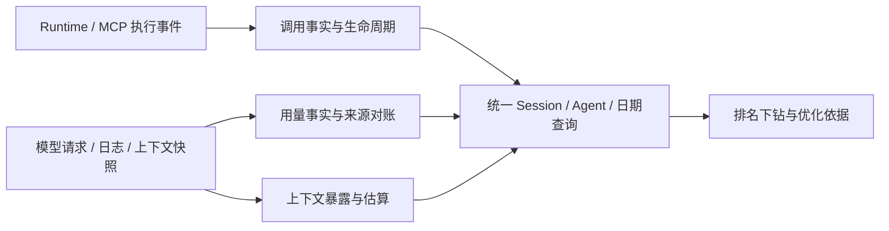

# OmniRoute 可借鉴逻辑与 Agent Usage 的适配边界

日期：2026-09-21。结论：**按模块借鉴协议边界、后台任务和缓存管理；保留本项目的请求身份、完整账本、能力归因和多模型词表体系。** OmniRoute 的网关用量分析与我们的目标有交集，但不能直接作为通用 Agent 用量采集核心。

分析版本：公开默认分支 `release/v3.8.51`，固定提交 [`7a921299c5b4c28dcf837f56a1c312b61414a646`](https://github.com/diegosouzapw/OmniRoute/commit/7a921299c5b4c28dcf837f56a1c312b61414a646)，提交时间 2026-09-19。通过 GitHub API 读取提交/文件树，并下载相关实现、许可证和测试进行源码核对；没有运行 OmniRoute，也没有采用其生产代码或新增依赖。下文的性能收益建议是适配判断，不是对 OmniRoute 的运行基准。

此前性能审查的 6 项修复已经完成，结果见[性能验证](../validation/2026-09-21-agent-usage-performance.md)。本分析是修复后的参考研究，不将尚未实施的建议写成已交付功能。

## 1. 哪些能力与我们的需求相符

| 需求 | 核对到的 OmniRoute 实现 | 我们的选择 |
| --- | --- | --- |
| 跨 Provider 用量归一化 | `usageExtractor` / `usageTracking` 识别多种 usage 结构、流式首尾事件及缓存字段 | 参考字段映射与测试场景；继续按显式协议/计量版本处理，不靠数值或名字猜语义 |
| Session、Agent、日期统计 | 网关用量表主要以 Provider、model、connection、API key、timestamp 分析 | 保留宿主绑定的 Agent / Session / Run / epoch，不将 API key 当成 Agent 身份 |
| 具体 MCP Tool 排名 | MCP 审计有调用次数、成功率、平均耗时和最近 24 小时 Top 10 | 只可参考执行指标；仍需我们的上下文暴露数据来算输入贡献 |
| Skill、插件、CLI 归属 | 工具目录存在 Skill/plugin 相关工具；审计记录实际 `toolName` | 目录类别不等于一次调用的能力归属；继续使用运行时投影和实际调用证据 |
| 任意模型的工具 token 估算 | 有启发式兜底，但离线分词模块仍用 `js-tiktoken` 的两个 GPT 编码 | 不移植分词模块，保留 Hugging Face 本地词表 + 显式通用兜底 |
| CPU、内存、磁盘成本 | 有 worker 队列、批量费用写入、缓存回收、历史汇总 | 选择性借鉴；账本不得套用可丢弃日志的策略 |

对应源码：[用量记录及持久化](https://github.com/diegosouzapw/OmniRoute/blob/7a921299c5b4c28dcf837f56a1c312b61414a646/src/lib/usage/usageHistory.ts#L665-L803)、[MCP 审计统计](https://github.com/diegosouzapw/OmniRoute/blob/7a921299c5b4c28dcf837f56a1c312b61414a646/open-sse/mcp-server/audit.ts#L369-L505)、[工具目录](https://github.com/diegosouzapw/OmniRoute/blob/7a921299c5b4c28dcf837f56a1c312b61414a646/open-sse/mcp-server/toolSearch/catalog.ts)。

## 2. 最值得参考：流式计量的终态与来源

OmniRoute 的透传流在 `flush()` 阶段才对缺失 usage 的情况决定是否估算；已有真实尾部 usage 时，不再补发一份估算。其测试特意覆盖“文本结束之后才到达真实 usage”，避免先输出估算再丢弃真实统计。[流式收尾](https://github.com/diegosouzapw/OmniRoute/blob/7a921299c5b4c28dcf837f56a1c312b61414a646/open-sse/utils/stream.ts#L2688-L2745)、[尾部 usage 回归](https://github.com/diegosouzapw/OmniRoute/blob/7a921299c5b4c28dcf837f56a1c312b61414a646/tests/unit/stream-passthrough-usage-estimation.test.ts#L95-L132)。

我们的采集应借鉴收尾规则：文本 `finish_reason`、流终止、usage 完整性分别判断；累计快照替换，增量才相加；中断保留已观测字段并标记不完整。同一请求的迟到终态通过原身份修订，而不是新增账单。当前 `capture/protocol.ts` 已在观察副本上归并 SSE usage；没有必要引入 OmniRoute 的协议翻译和响应改写框架。

它将上下文安全余量放在单独的 `context_budget_*` 字段，避免把规划预算混入已报告消耗；本地估算也有独立标记。这个“来源分离”的原则适合保留。[预算与用量分离](https://github.com/diegosouzapw/OmniRoute/blob/7a921299c5b4c28dcf837f56a1c312b61414a646/open-sse/utils/usageTracking.ts#L180-L226)、[估算标记](https://github.com/diegosouzapw/OmniRoute/blob/7a921299c5b4c28dcf837f56a1c312b61414a646/open-sse/utils/usageTracking.ts#L655-L680)。

**后续接入 OmniRoute 等估算网关时有一个额外适配项：**当前 HTTP 快照规范化将响应 usage 视为 `reported`。如果上游明确给出 `estimated: true`，应保留估算来源，不能升级为模型原生计量；进程内 Symbol 标记也不能代替跨 HTTP/SQLite 的可序列化来源字段。此项属于未来网关适配，当前没有宣称已接通 OmniRoute。

Provider 字段兼容可参考其别名和测试集，例如缓存写入的嵌套字段、DeepSeek 缓存命中、Gemini thoughts 与输出总量的关系。但不能照搬将缺失字段归零的分支：我们的 unknown/null 与真实 0 必须可区分。[非流式提取](https://github.com/diegosouzapw/OmniRoute/blob/7a921299c5b4c28dcf837f56a1c312b61414a646/open-sse/handlers/usageExtractor.ts)、[提取回归用例](https://github.com/diegosouzapw/OmniRoute/blob/7a921299c5b4c28dcf837f56a1c312b61414a646/tests/unit/usage-extractor.test.ts)。

## 3. 性能参考：worker、批次和缓存分别处理

### worker：采用生命周期，改掉丢弃语义

`callLogArtifactWriter` 使用一个按需创建的 worker、最多 128 个排队任务、30 秒空闲回收和默认 2 秒关闭等待；错误和队列满时放弃日志详情，让业务继续。[worker 写入器](https://github.com/diegosouzapw/OmniRoute/blob/7a921299c5b4c28dcf837f56a1c312b61414a646/src/lib/usage/callLogArtifactWriter.ts)。

我们的冷分词、解压后解析和较大查询可参考这种隔离方式。适配时必须同时约束任务数、累计字节和单项字节；分词资产由有界 worker 复用，避免每个 worker 都复制所有词表。账本写入仍由现有宿主串行事务负责。队列满或 worker 失败时保留待处理/失败状态与重试依据，不能返回成功再丢弃统计；Reset/cleanup 继续等待已接纳任务收尾。是否实施以事件循环延迟和队列等待实测为依据。

### 批次：费用缓冲不能直接作为账本入口

`SpendBatchWriter` 默认 60 秒或达到 1,000 项触发 flush，合并并发 flush，失败时重新入队；查询预算时同时考虑等待与正在写入的数据。这有助于减少重复写入。[批量费用写入](https://github.com/diegosouzapw/OmniRoute/blob/7a921299c5b4c28dcf837f56a1c312b61414a646/src/lib/spend/batchWriter.ts)、[相关测试](https://github.com/diegosouzapw/OmniRoute/blob/7a921299c5b4c28dcf837f56a1c312b61414a646/tests/unit/spend-batch-writer.test.ts)。

但 `maxBufferSize` 在该类中是 flush 触发阈值，不是硬容量；持续入队及持久化失败可以继续扩大内存队列。未落盘部分还存在进程崩溃丢失窗口。我们的文件采集现已每批最多 100 条原子提交事件和 checkpoint，应继续这个恢复合同；不能换成一分钟纯内存缓冲。未来后台写入必须有持久化意图、稳定幂等键和明确的背压策略。

### 缓存：统计淘汰，避免只看一个 Map 的 size

`boundedMap` 区分 LRU 和 TTL，有淘汰计数、超限计数和限频告警；`usageHistory` 同时回收 pending 主索引、关联索引、明细桶和计数器。[缓存实现](https://github.com/diegosouzapw/OmniRoute/blob/7a921299c5b4c28dcf837f56a1c312b61414a646/src/lib/quota/boundedMap.ts)、[pending 清扫](https://github.com/diegosouzapw/OmniRoute/blob/7a921299c5b4c28dcf837f56a1c312b61414a646/src/lib/usage/usageHistory.ts#L205-L287)。

可借鉴“所有索引成对回收”和 hit/miss/eviction/overflow 诊断。该 Map 的受保护条目允许超过容量，因此不能把它当严格内存预算。MCP 活跃票据的撤销仍以 Session/Run 生命周期为准，不能仅按 TTL 丢掉尚需提交结束事件的权限；本次已经修复维护、删除和移除 Server 的释放路径。

## 4. 不移植其分词实现

核对版本的 `tiktokenCounter.ts` 仍依赖 `js-tiktoken`：Codex 类模型选择 `o200k_base`，其余默认 `cl100k_base`；超过 50,000 字符或分词异常时按字符比例兜底。它会剔除图片 data URI，以免将大段 Base64 当作普通文本分词。[分词源码](https://github.com/diegosouzapw/OmniRoute/blob/7a921299c5b4c28dcf837f56a1c312b61414a646/src/shared/utils/tiktokenCounter.ts)。

我们保留 `@huggingface/tokenizers`、本地固定词表指纹、按模型/Provider 匹配、通用 Unicode 兜底和估算来源。值得借鉴的是输入限额与多模态排除，而非 GPT 编码选择或“所有模型同一字符比例”。缺模型词表时给方向性估算；多模态、内容未采集和超预算仍需要如实标明覆盖缺口，不能伪装成模型精确值。

## 5. 不采用会重新造成偏小的去重与历史裁剪

### 去重保留稳定请求身份

`saveRequestUsage()` 以时间戳、Provider、model、connection、API key 和输入/输出 token 值组合判断重复。源码注释称同秒去重，但实际 SQL 使用完整 timestamp 相等，不能将注释当作额外的秒级归一化。[实际 SQL](https://github.com/diegosouzapw/OmniRoute/blob/7a921299c5b4c28dcf837f56a1c312b61414a646/src/lib/usage/usageHistory.ts#L710-L752)。

对通用采集器的适配判断：两个合法请求如果这些字段相同，可能被合并；同一请求的不同采集时刻又可能无法去重。我们继续使用来源事件身份、Provider 请求身份、Session/epoch、revision/finality 和覆盖范围对账。测试必须同时证明“相同事件重放只计一次”和“相同内容的两个真实请求计两次”。

### 日汇总不能替代可追溯明细

OmniRoute 清理旧请求前先按 Provider/model/day 汇总，汇总报错就停止删除；查询将近期请求与旧日汇总按 cutoff 拼接。其日表不保留 connection/API key 等明细身份，查询在 API key 筛选时排除汇总分支。[清理入口](https://github.com/diegosouzapw/OmniRoute/blob/7a921299c5b4c28dcf837f56a1c312b61414a646/src/lib/db/cleanup.ts#L102-L145)、[汇总写入](https://github.com/diegosouzapw/OmniRoute/blob/7a921299c5b4c28dcf837f56a1c312b61414a646/src/lib/usage/aggregateHistory.ts#L130-L299)、[合并查询](https://github.com/diegosouzapw/OmniRoute/blob/7a921299c5b4c28dcf837f56a1c312b61414a646/src/lib/db/usageAnalytics/sources.ts#L46-L145)。

这种维度丢失不适合我们的 Session、Agent、具体工具下钻。只保存 UTC 日桶也无法还原任意 IANA 时区或部分日期区间。可以借鉴数据库聚合、清理前验证和统一 cutoff，但后续物化汇总应是**可重建查询加速层**：保留事实和来源身份，修订时修正受影响投影，不替换完整账本。若将来确实要减少保留维度，应作为显式产品合同另行设计。

## 6. MCP 排名与优化建议如何采用

OmniRoute 的 `logToolCall()` 保存工具名、输入哈希、输出摘要、耗时、API key 和成功状态；`getAuditStats()` 返回最近 24 小时的次数 Top 10。审计没有“每次模型请求里工具定义/参数/结果的暴露 token”字段；输出摘要还保存最多 200 个字符，不符合我们当前不落正文的边界。[审计实现](https://github.com/diegosouzapw/OmniRoute/blob/7a921299c5b4c28dcf837f56a1c312b61414a646/open-sse/mcp-server/audit.ts#L369-L505)、[摘要实现](https://github.com/diegosouzapw/OmniRoute/blob/7a921299c5b4c28dcf837f56a1c312b61414a646/open-sse/mcp-server/schemas/audit.ts#L105-L122)。

因此保留两条证据链：执行证据解释调用次数/错误/耗时；模型请求暴露解释定义输入、参数输入、结果首次输入和重复输入。Skill/plugin 是同一证据的归属视角，不能与 MCP/CLI 行相加成账单。

它的 `tool_search` 返回关键词匹配后的简短工具签名，适合参考按需发现交互；核对到的搜索模块本身没有证明其他工具 schema 已从初始上下文移除，不能仅增加搜索工具就宣称节省 token。[搜索工具注册](https://github.com/diegosouzapw/OmniRoute/blob/7a921299c5b4c28dcf837f56a1c312b61414a646/open-sse/mcp-server/toolSearch/register.ts)、[搜索响应](https://github.com/diegosouzapw/OmniRoute/blob/7a921299c5b4c28dcf837f56a1c312b61414a646/open-sse/mcp-server/toolSearch/handler.ts)。

更直接的落点是利用现有排名生成可核验建议：

- 定义输入高、实际调用少：建议缩小 Agent 的工具选择；只有 Runtime 支持延迟发现时才考虑按需注入。用同类任务的定义输入总量和完成率验证。
- 重复结果输入高：建议工具侧分页、字段裁剪或摘要返回；观察重复输入、后续重查次数和任务结果，不能在采集器中删数据来制造降耗。
- 失败/重试高：先修工具参数、鉴权或失败恢复；比较成功一次所需调用与 token，而不只比较平均单次体积。

这些是后续建议层设计，本次没有自动修改 Agent 的 MCP/Skill 配置。

## 7. 按需采用顺序与拆分边界

1. **协议和测试样例优先。** 接入新增上游时提取字段别名、尾部 usage、估算来源和中断恢复场景，经过本项目合同测试再采用；不整体移入大型 stream 翻译器。
2. **根据实测延迟引入有界 worker。** 本次仍测到较大全量排名约 228 ms、256 KiB 冷分词约 165 ms；若目标并发下影响业务，再按任务数/字节预算隔离并保留维护屏障。缓存诊断指标可以随该阶段补充。
3. **用现有排名形成优化建议。** 先提供原因、证据和前后对比；涉及运行配置改变时由用户决策，不把调用次数下降直接等同效果改善。
4. **容量达到需要时再物化汇总。** 保持迟到修订、时区、完整历史与下钻能力，避免为减少当前小库体积提前建立第二套账本。

未来独立分发继续沿用现有 core/adapters/storage 与 host 分层：通用层使用 opaque Agent/Session/Run/epoch 字符串，宿主负责业务映射、授权和维护；HTTP relay 只是可选采集入口，MCP/CLI/日志入口各自提供证据。无需将独立项目变成全功能模型路由网关，也不要求 Claude Code 原生遥测。

仓库顶层为 [MIT License](https://github.com/diegosouzapw/OmniRoute/blob/7a921299c5b4c28dcf837f56a1c312b61414a646/LICENSE)。如以后实际复制实现或测试片段，应记录来源文件和固定提交，保留适用的版权/许可证声明，并检查该文件是否带额外第三方来源说明。本次仅记录参考方案，没有把下载的源码带入项目。
